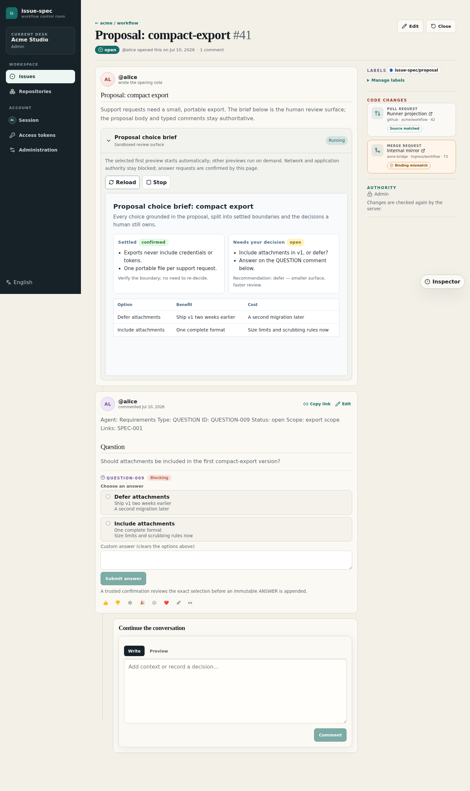
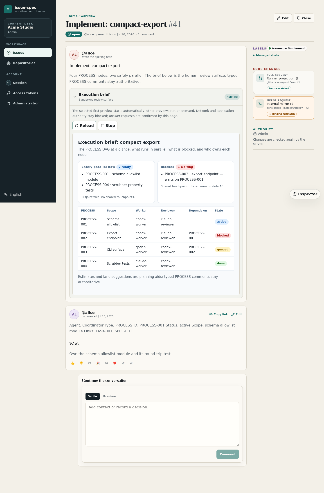

# issue-spec

**English | [简体中文](README.zh-CN.md)**

`issue-spec` is an issue-native, self-hostable spec workflow for agentic
software development: strengthen human review of the proposal and the design
*before* code gets written, then orchestrate the implementation as small tasks
that each go to the right agent.

```text
-> review requirements and design first, code second
-> active changes in issues and typed comments, durable specs in the repo
-> human review rendered as rich HTML, human decisions as structured answers
-> implementation as an agent DAG, each PROCESS owned by the right agent
-> agents read the same state through a lean CLI, without the HTML weight
```

Every substantial change moves through three issues — **Proposal** (what and
why), **Design** (how and acceptance), **Implement** (execution DAG) — with
typed `SPEC`, `QUESTION`, `TASK`, `PROCESS`, `REVIEW`, and `VERIFY` comments
keeping traceability from requirement to merged line.

## A self-hosted workspace for your team

Run an operator-controlled issue-spec server on your own infrastructure:
browser workspace, GitHub-compatible issue API, organization and repository
authorization, service accounts, provider-neutral code evidence, runners,
webhooks, and durable PostgreSQL state — while source code, PRs/MRs, reviews,
and CI stay on the code host your team already uses.

### Review surfaces built for human decisions

Agents publish each phase as a sandboxed `html-preview` review projection: a
rendered brief that shows what changed, what is settled, and what still needs a
decision. Open decisions are typed `QUESTION` comments, answered right on the
issue page with native controls; every confirmed choice becomes an immutable
`ANSWER` record that later agents and workflow gates consume.

The **Proposal** choice brief separates settled boundaries from the decisions a
human still owns, with the native answer panel right below it:

[](docs/self-hosting/README.md)

The **Design** explainer renders the data flow, invariants, rejected
alternatives, and acceptance checks:

[](docs/self-hosting/README.md)

The **Implement** execution brief shows the PROCESS DAG: what runs in parallel,
what is blocked, and which agent owns each node:

[](docs/self-hosting/README.md)

The HTML stays out of agent context: agents read proposals, designs, questions,
and effective answers through the `issue-spec` CLI, which returns the compact
canonical artifacts instead of the rendered review surfaces — human-friendly
review without token-heavy agent reads.

### Issues, search, and change management

Proposal, design, and implement issues keep the current artifact in the body
and the full decision history in the timeline. Lists, filters, and labels keep
in-flight changes findable across repositories.

[](docs/self-hosting/README.md)

Full-text search groups matching issues and comments by their related change,
so one query surfaces the historical proposal, design, and implement trail a
new change should build on:

[](docs/self-hosting/README.md)

The same capability is CLI-native — agents run
`issue-spec search issues --repo owner/repo --query "..." --source change --stage design`
to find prior related changes and their decisions before proposing a new one.

Change boards group the three phase issues into one change and expose
lifecycle, TASK/PROCESS progress, and linked code changes — a GitHub pull
request and an internal merge request can sit under the same change.

[](docs/self-hosting/README.md)

**[Self-hosted server: architecture, access model, deployment, operations →](docs/self-hosting/README.md)**

## One shared context for humans and agents

The `issue-spec` CLI is how agents participate in the same workflow humans
review in the browser:

- agents author and read the typed artifacts (`SPEC`, `TASK`, `PROCESS`, ...)
  with validation, safe transitions, and workflow gates
- a coordinator splits implementation into PROCESS nodes and dispatches each to
  the agent that fits it — workers, reviewers, and verifiers stay in narrow,
  effective context windows
- teammates and their agents pick up any change mid-flight, because the entire
  state — decisions, blockers, review findings, evidence — lives in the issues,
  not in someone's local files
- `issue-spec runner` executes authorized comment commands (`/new`, `/resume`)
  in managed workspaces, so work can be triggered straight from an issue

Line-level PR findings, rationale, and checks sync back into `REVIEW` comments,
and `verify` gates the change on unresolved blocking questions, traceability,
and P0/P1 findings before archive.

## Works with GitHub too

The same workflow runs directly against github.com or GitHub Enterprise using
your `gh` login — issues, typed comments, PR review threads, and durable spec
archive PRs. The only self-host-specific conveniences are the rendered
`html-preview` review surfaces and the interactive QUESTION answer panel:
GitHub shows their source as plain readable Markdown instead, and answers are
recorded through the CLI.

## Quick start

Install the CLI:

```bash
go install github.com/higress-group/issue-spec/cmd/issue-spec@latest
```

Authenticate (GitHub mode reuses your `gh` session) and initialize a
repository:

```bash
gh auth login
issue-spec init --repo owner/repo --create-labels --tools codex,claude --delivery both
```

Then drive the workflow from your agent with the generated skills or slash
commands:

```text
/issue-spec:propose "your idea"
/issue-spec:apply
/issue-spec:review
/issue-spec:verify
/issue-spec:archive
```

To self-host the server for your team, start from the
**[self-hosting guide](docs/self-hosting/README.md)**.

## Learn more

- **[Workflow guide](docs/workflow.md)** — full walkthrough, workflow model, multi-agent coordination, review flow, GitHub-mode setup
- **[CLI reference](docs/reference.md)** — configuration, command contracts, canonical typed comments
- **[Runner operations](docs/runner.md)** — comment intake, authorization, sandboxing, concurrency, recovery
- **[Workflow safety](docs/workflow-safety.md)** — gates, reconciliation, PROCESS evidence
- **[Self-hosting](docs/self-hosting/README.md)** — architecture, authentication, bridges, operations

## Development

Local builds and tests use the Go toolchain declared in [`go.mod`](go.mod):

```bash
go build ./cmd/issue-spec
go test ./...
```

`go test ./...` is the same unit test command CI runs
(see [`.github/workflows/unit-tests.yml`](.github/workflows/unit-tests.yml)).

## Acknowledgements

`issue-spec` is inspired by [OpenSpec](https://github.com/Fission-AI/OpenSpec)
and preserves its spec-first workflow habits while adapting active change
state, human review, and multi-agent coordination to issues and pull requests.
See [the workflow guide](docs/workflow.md#relationship-to-openspec) for how the
two relate.
