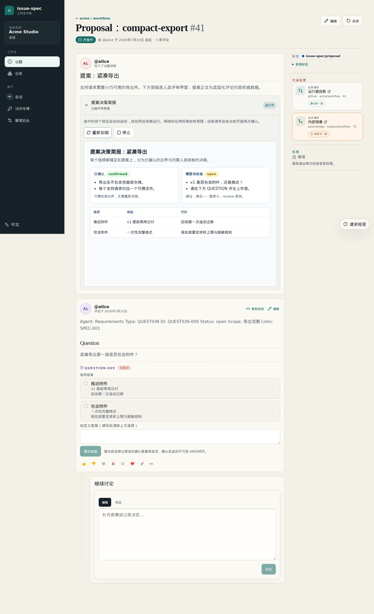
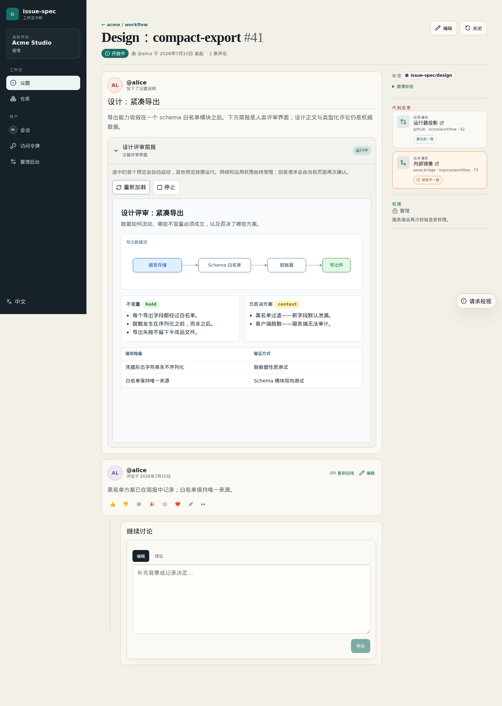
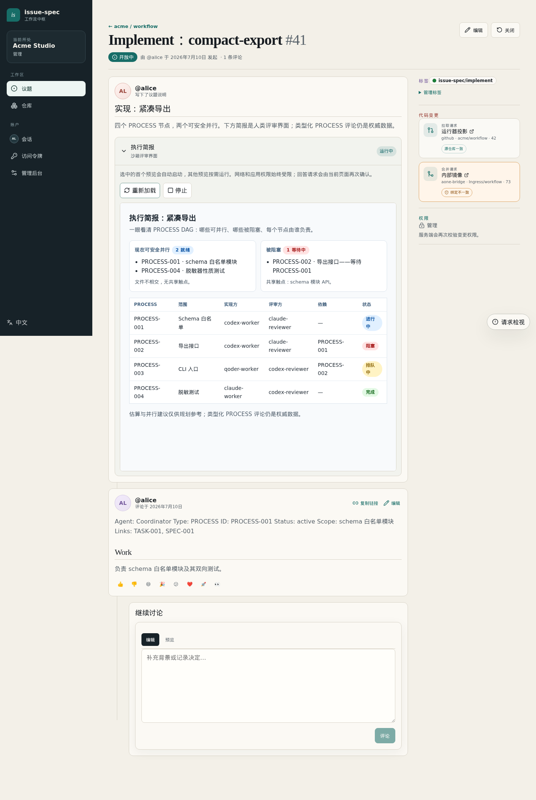
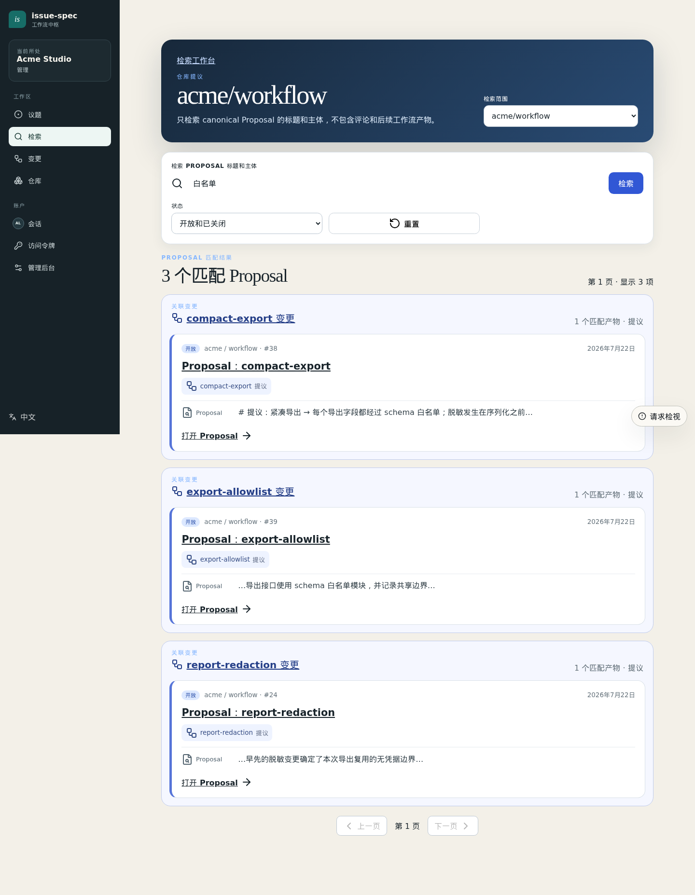

# issue-spec

**[English](README.md) | 简体中文**

`issue-spec` 是一套 issue 原生、可自托管的 spec 工作流，面向 agent 驱动的软件开发：在进入编码之前，先强化对需求（Proposal）与设计（Design）的人工评审；再把实现（Implement）编排成小任务，让每个任务分配给合适的 agent 处理。

```text
-> 先评审需求与设计，再写代码
-> 进行中的变更放在 issue 与类型化评论里，长期 spec 留在仓库里
-> 人类评审以富 HTML 呈现，人类决策以结构化答案记录
-> 实现是一张 agent DAG，每个 PROCESS 由最合适的 agent 负责
-> agent 通过精简的 CLI 读取同一份状态，不背 HTML 的包袱
```

每个实质性变更经过三个 issue —— **Proposal**（做什么、为什么）、**Design**（怎么做、如何验收）、**Implement**（执行 DAG）——由类型化的 `SPEC`、`QUESTION`、`TASK`、`PROCESS`、`REVIEW`、`VERIFY` 评论把可追溯性从需求一直保持到合入的每一行代码。

## 为团队自托管一个工作台

在自己的基础设施上运行由团队掌控的 issue-spec Server：浏览器工作台、GitHub 兼容 issue API、组织与仓库权限、Service Account、Provider-neutral 代码证据、Runner、Webhook 与持久化 PostgreSQL 状态——而源代码、PR/MR、Review 和 CI 继续留在团队已有的代码托管平台上。

### 为人类决策而生的评审界面

Agent 会把每个阶段发布为一份沙箱化的 `html-preview` 评审投影：一份渲染出来的简报，讲清楚改了什么、哪些已定、哪些还需要拍板。开放决策是类型化的 `QUESTION` 评论，直接在 issue 页面上用原生控件作答；每次确认的选择都会成为一条不可变的 `ANSWER` 记录，供后续 agent 与工作流关卡消费。

**Proposal** 决策简报把已确认的边界与仍需人类拍板的决策分开，原生答题面板就在简报下方：

[](docs/self-hosting/README.zh-CN.md)

**Design** 评审简报渲染数据流、不变量、已否决方案与验收检查：

[](docs/self-hosting/README.zh-CN.md)

**Implement** 执行简报展示 PROCESS DAG：哪些可并行、哪些被阻塞、每个节点由哪个 agent 负责：

[](docs/self-hosting/README.zh-CN.md)

这些 HTML 不会进入 agent 上下文：agent 通过 `issue-spec` CLI 读取 proposal、design、question 与生效答案，CLI 返回的是精简的 canonical 产物而非渲染后的评审界面——人类看得舒服，agent 读得省 token。

### Issue、检索与变更管理

Proposal、design、implement issue 的正文承载当前产物，时间线承载完整决策历史。列表、过滤器与标签让进行中的变更跨仓库可检索。

[](docs/self-hosting/README.zh-CN.md)

全文检索会把命中的 issue 与评论按其关联变更分组：一次查询就能找到新变更应该参考的历史 proposal、design、implement 轨迹：

[](docs/self-hosting/README.zh-CN.md)

同样的能力也是 CLI 原生的——agent 可以用
`issue-spec search issues --repo owner/repo --query "..." --source change --stage design`
在提新变更之前先找到历史关联变更及其决策。

变更看板把三个阶段 issue 聚合为一个变更，展示生命周期、TASK/PROCESS 进度与关联代码变更——一个 GitHub pull request 和一个内部 merge request 可以挂在同一个变更下。

[](docs/self-hosting/README.zh-CN.md)

### Issue 与代码分属两个权威

自托管有意把 issue 状态与代码状态分开：Server 是 issue 与类型化工作流产物的权威，
而团队已有的代码托管平台仍是源代码、分支、PR/MR、Review、CI 与合并的权威。
两者通过运维注册的 **code-provider bridge** 连接：bridge 上报规范化、绑定修订版本的代码证据
（并且只执行显式请求的外部变更）；关卡仍由 Server 自己评估。一个变更可以并排关联多个
平台——同一个 Change 下同时挂一个 GitHub pull request 和一个内部 merge request。

```yaml
# issue-spec/config.yaml — 仓库侧选择运维注册的 bridge
external_code:
  provider_key: code.example
  evidence:
    required: [review, check, merge]
    freshness: { review: 24h, check: 1h }
```

- [对接公司代码与工作平台](docs/self-hosting/enterprise-provider-integration.md) —— 平台盘点、Source Binding、工作单跟踪
- [Code provider bridge 协议 v1](docs/self-hosting/bridges/code-provider-v1.md) —— 信任边界、证据写入
- [Runner Git 凭据命令 v1](docs/self-hosting/bridges/git-credential-v1.md) —— Runner 的 clone/push 凭据

**[自托管 Server：架构、权限模型、部署与运维 →](docs/self-hosting/README.zh-CN.md)**

## 人与 agent 共享同一份上下文

`issue-spec` CLI 让 agent 参与到人类在浏览器里评审的同一套工作流中：

- agent 以校验、安全变更与工作流关卡为约束，编写并读取类型化产物（`SPEC`、`TASK`、`PROCESS` 等）
- 协调器把实现拆成 PROCESS 节点，分派给最合适的 agent——worker、reviewer、verifier 各自保持在窄而有效的上下文窗口内
- 团队成员和他们的 agent 可以中途接手任何变更，因为全部状态——决策、阻塞、review 发现、证据——都在 issue 里，而不在某个人的本地文件里
- `issue-spec runner` 在受管工作区内执行经过授权的评论命令（`/new`、`/resume`），直接从 issue 触发工作

PR 行级发现、rationale 与检查会同步回 `REVIEW` 评论；`verify` 在归档前以未解决的阻塞问题、可追溯性与 P0/P1 发现为关卡。

## 兼容对接 GitHub

同一套工作流可以直接用你的 `gh` 登录对着 github.com 或 GitHub Enterprise 运行——issue、类型化评论、PR review 线程与长期 spec 归档 PR 全部可用。只有两个能力是自托管特有的便利：渲染出的 `html-preview` 评审界面与交互式 QUESTION 答题面板；在 GitHub 上它们退化为可读的普通 Markdown 源码，答案改由 CLI 记录。

## 快速开始

安装 CLI：

```bash
go install github.com/higress-group/issue-spec/cmd/issue-spec@latest
```

认证（GitHub 模式复用你的 `gh` 会话）并初始化仓库：

```bash
gh auth login
issue-spec init --repo owner/repo --create-labels --tools codex,claude --delivery both
```

然后在你的 agent 里通过生成的 skills 或 slash 命令驱动工作流：

```text
/issue-spec:propose "your idea"
/issue-spec:apply
/issue-spec:review
/issue-spec:verify
/issue-spec:archive
```

要为团队自托管 Server，请从**[自托管指南](docs/self-hosting/README.zh-CN.md)**开始。

## 了解更多

- **[工作流指南](docs/workflow.zh-CN.md)** —— 完整演示、工作流模型、多 agent 协调、review 流程、GitHub 模式配置
- **[CLI 参考](docs/reference.zh-CN.md)** —— 配置、命令契约、canonical 类型化评论
- **[Runner 运维](docs/runner.zh-CN.md)** —— 命令接入、授权、沙箱、并发、恢复
- **[工作流安全](docs/workflow-safety.md)** —— 关卡、reconcile、PROCESS 证据
- **[自托管](docs/self-hosting/README.zh-CN.md)** —— 架构、认证、Bridge、运维

## 开发

本地构建与测试使用 [`go.mod`](go.mod) 中声明的 Go 工具链：

```bash
go build ./cmd/issue-spec
make build-server
go test ./...
```

`go test ./...` 与 CI 运行的单元测试命令一致（参见 [`.github/workflows/unit-tests.yml`](.github/workflows/unit-tests.yml)）。
要连接 PostgreSQL 启动 Server，请阅读
[本地 Server 开发指南](docs/self-hosting/local-development.zh-CN.md)。

## 致谢

`issue-spec` 受 [OpenSpec](https://github.com/Fission-AI/OpenSpec) 启发，保留其 spec 优先的工作流习惯，并把进行中的变更状态、人工评审与多 agent 协调适配到 issue 与 pull request 上。两者的关系详见[工作流指南](docs/workflow.zh-CN.md#与-openspec-的关系)。
