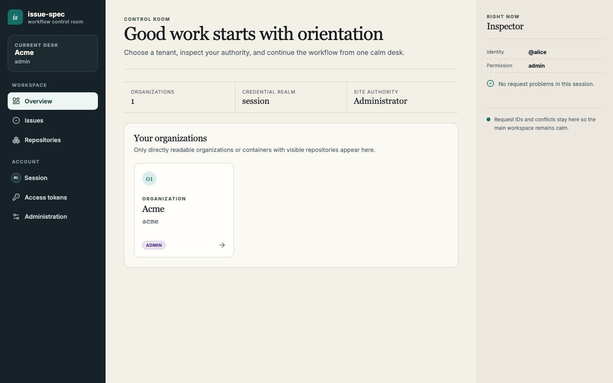
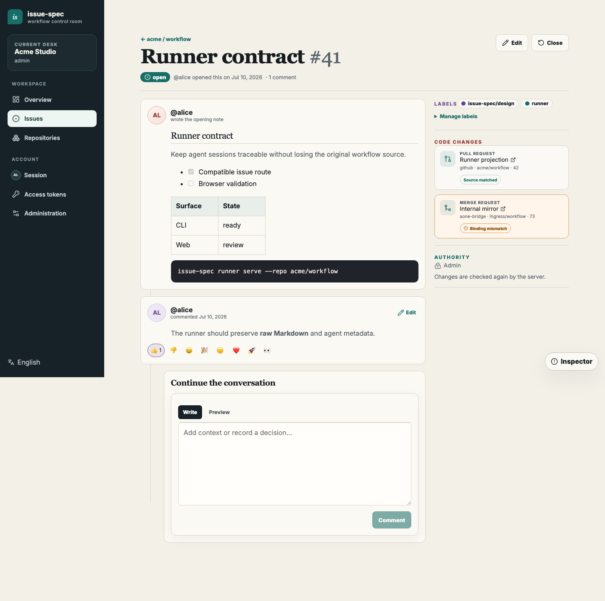
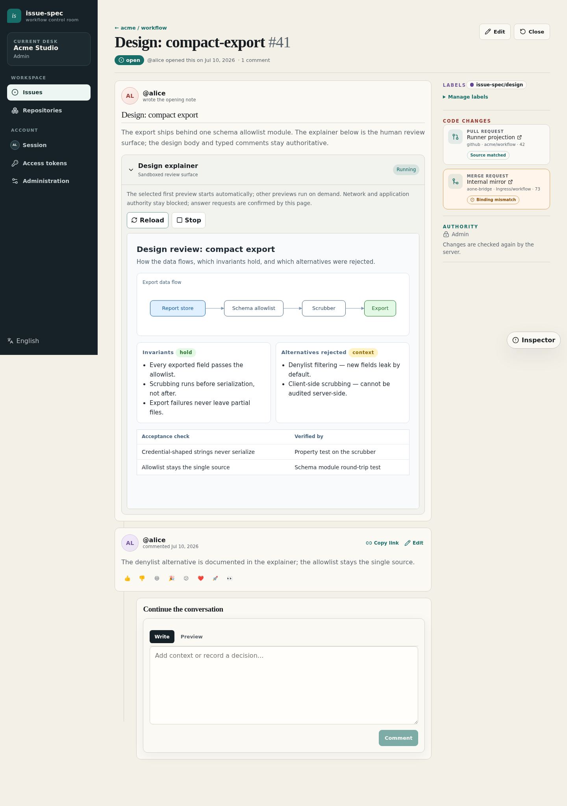
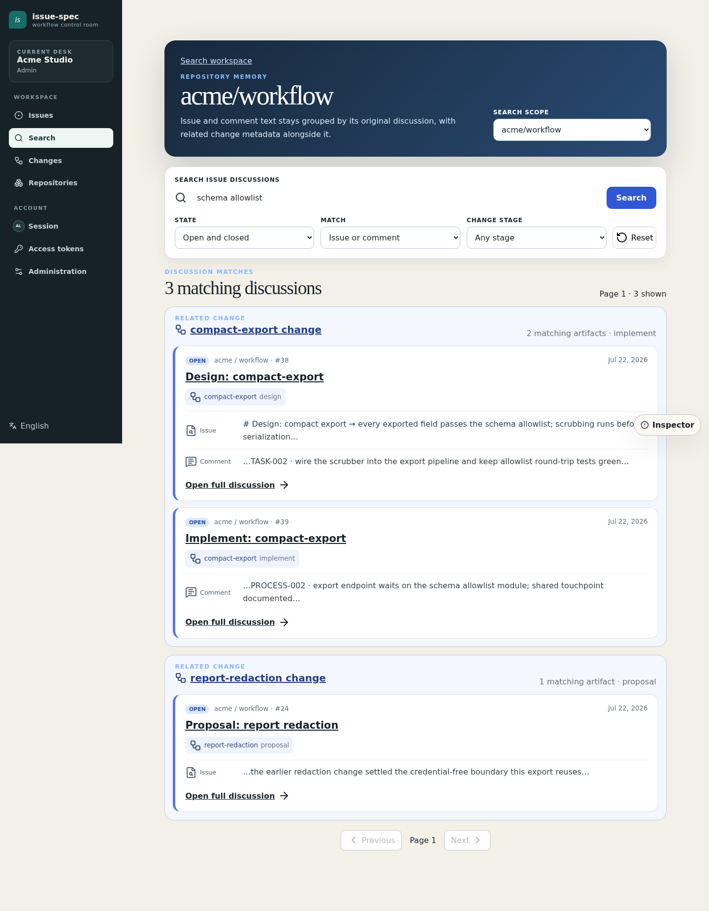
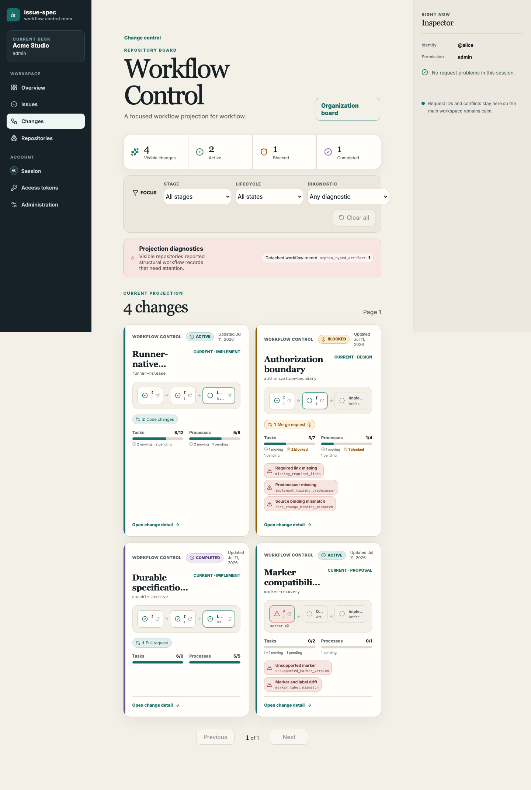
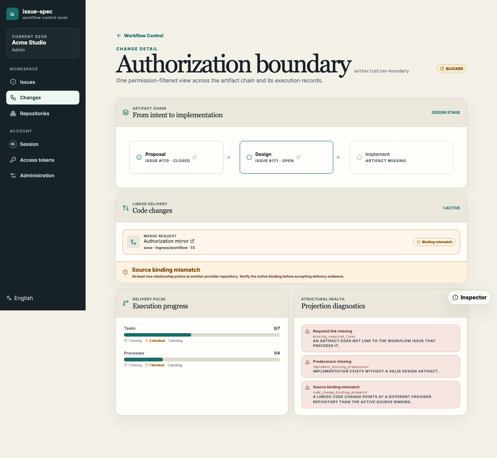
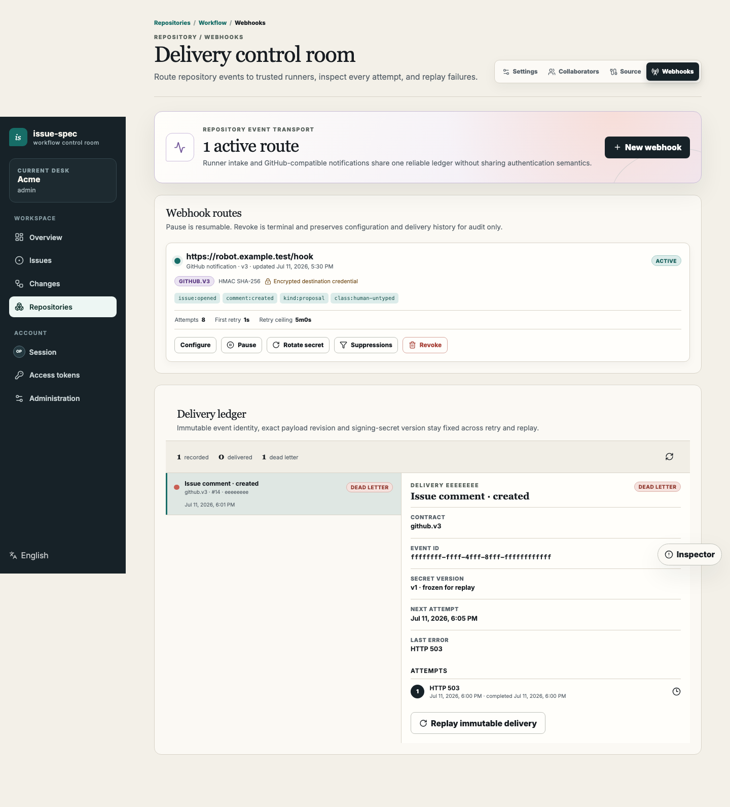

# Self-hosted issue-spec server

**English | [简体中文](README.zh-CN.md)**

The self-hosted server brings the issue-native issue-spec workflow to an
operator-controlled environment. It combines a browser workspace, a
GitHub-compatible issue API, organization and repository authorization,
provider-neutral code evidence, webhooks, runners, and durable PostgreSQL
state in one deployable service.

Use self-hosting when a team needs private-network deployment, local identity
and authorization, internal code-host integration, or automation identities
that do not depend on a personal GitHub account.



## What the server owns

```text
Browser and issue-spec CLI
          |
          v
 issue-spec-server  <---->  GitHub OAuth or OIDC
    |       |
    |       +------------>  code-provider bridge / evidence ledger
    |       +------------>  GitHub-compatible or runner webhooks
    v
 PostgreSQL
```

The server is authoritative for:

- organizations, repositories, memberships, collaborators, and visibility;
- issues, comments, labels, reactions, typed workflow projections, and change
  boards;
- personal and managed access tokens, service accounts, optional token delegation,
  source bindings, evidence policies, and immutable evidence;
- webhook subscriptions, filtering, encrypted credentials, delivery attempts,
  retries, replay, and audit records.

The external code host remains authoritative for source code, branches,
commits, pull requests or merge requests, reviews, and CI. A source binding and
code-provider adapter project that evidence into issue-spec without giving the
server ambient source credentials.

## Product tour

### Issues keep the full decision history

Proposal, design, and implementation issues carry the current artifact in the
issue body. SPEC, QUESTION, TASK, and PROCESS records are active typed comments
in the same timeline. Historical REVIEW and VERIFY records remain visible for
audit only. Ordinary human comments remain available for discussion and
notifications.



### Review projections render for humans, questions get native answers

Agents publish sandboxed `html-preview` review projections for each phase — a
proposal choice brief, a design explainer, and an implement execution brief —
and every typed QUESTION comment carries a native answer panel. Confirmed
choices become immutable typed ANSWER comments that later agents and gates
consume.



### Search groups matches by related change

Full-text search covers issue bodies and comments and groups matches by their
related change and stage, so reviewers and agents can trace the historical
proposal, design, and implement trail behind any keyword. The same query runs
from the CLI with `issue-spec search issues --source change --stage <stage>`.



### Change boards show workflow state, not just issue counts

The change board groups proposal, design, and implementation issues into one
change. It exposes lifecycle, TASK and PROCESS progress, diagnostics, and
linked code changes without making the external code provider the issue
backend.



The detail view keeps traceability and provider-neutral code relationships in
one place. A GitHub pull request and an internal merge request can appear under
the same change while retaining their provider identity.



### Search recovers earlier decisions before the next change

When the operator enables PostgreSQL search, the browser workspace can search
visible issue bodies and comments, including closed discussions, and group
matches by issue with related change keys and stages. Authorization filtering
happens before matching, ranking, totals, excerpts, or pagination. Search
requests accept at most 256 query bytes and 50 results per page, and the
server applies a five-second database query deadline while preserving any
earlier caller deadline.

Direct Codex, Claude, and other issue-spec clients use the same capability:

```bash
issue-spec --profile team search issues \
  --repo acme/workflow \
  --query ListConfigsBySource \
  --state all \
  --limit 10
```

Search output keeps user-authored titles and excerpts inside untrusted data
boundaries and points the agent to `read issue --comments` for the selected
full discussion. This is a general issue-spec workflow; runner-dispatched
agents reuse it rather than defining a runner-only search process. See the
[deployment guide](operations/deployment.md#optional-postgresql-issue-search)
for the explicit extension and startup contract.

### Integrations are policy controlled and auditable

Repository administrators can configure runner intake or `github.v3`
notification webhooks. Notification policies can select issue actions, change
kinds, human or typed comments, and human or automation actors. Query
credentials are encrypted and never returned to the browser after creation.



## Access model

Repository visibility controls reads. Contribution policy separately controls
who may create issues or comments.

| Visibility | Anonymous | Authenticated outsider | Member or collaborator |
| --- | --- | --- | --- |
| `public` | read | read | read |
| `internal` | concealed | read | read |
| `private` | concealed | concealed | read |

| Contribution policy | Who may contribute |
| --- | --- |
| `disabled` | nobody |
| `members` | organization members, service accounts, or explicit collaborators |
| `authenticated` | any active signed-in identity |
| `public` | any active signed-in identity when repository visibility is public |

Anonymous mutation is always denied. Signing in through GitHub OAuth or OIDC
creates an external identity; it does not implicitly grant an organization
role, repository permission, runner authority, or evidence publication
authority. Evidence publication additionally requires explicit credential scope
and live repository permission.

## Deployment path

The production artifact is a single `issue-spec-server` binary or the
repository runtime container. The binary embeds the generated web application.
PostgreSQL and three operator-owned secret files are required. A fourth,
optional SMTP secret file enables verified notification email, mentions, and
explicit repository email subscriptions; leaving it absent keeps those
capabilities disabled without affecting issue or webhook operation.

1. Read the [deployment and hardening guide](operations/deployment.md).
2. Choose HTTPS or complete the
   [trusted internal HTTP checklist](authentication/v1/trusted-internal-http.md).
3. Configure [GitHub OAuth](authentication/v1/github-oauth.md) or
   [OIDC](authentication/v1/oidc.md).
4. Build a reproducible server artifact:

   ```bash
   make release-server
   # or
   make docker-server IMAGE=registry.example/issue-spec-server:VERSION
   ```

5. Start PostgreSQL and the server with the required environment and secret
   mounts. Wait for `/readyz` before routing employee traffic.
6. Claim bootstrap once, sign in with the configured provider, create the
   first organization, and assign local roles explicitly.
7. Back up PostgreSQL together with the token pepper and encryption keyring;
   see [backup, restore, upgrade, and recovery](operations/backup-restore.md).

The `deployments/dev` fixture is for local development. Follow the
[local Server development guide](local-development.md) to run the complete
Compose stack or a host-built binary against its PostgreSQL service. Do not
copy its credentials or development posture into production.

## Connect a local repository

For the complete external-user path—from verified CLI installation and a
name-only PAT through a simple issue or standard Proposal/SPEC—follow
[Start a requirements workflow](requirements-onboarding.md).

Create a PAT from **Access tokens** in the web application, then configure an
origin-bound self-hosted profile. Read the canonical origins and instance ID
from `/api/v1/meta` instead of guessing them.

```bash
printf '%s\n' "$ISSUE_SPEC_TOKEN" | issue-spec auth login \
  --profile team \
  --kind self-hosted \
  --api-url https://issues.example.com \
  --native-api-url https://issues.example.com/api/v1 \
  --web-url https://issues.example.com \
  --instance-id issue-spec:00000000-0000-4000-8000-000000000000 \
  --with-token

issue-spec --profile team auth status --json
```

Initialize an existing server repository:

```bash
issue-spec --profile team init \
  --repo acme/workflow \
  --server-org acme \
  --server-repo workflow \
  --tools codex,claude \
  --delivery both
```

An authorized caller may add `--create-if-missing` to register the repository.
Use `--bind-source`, `--provider`, and the external repository coordinates when
the source lives on a separate code host. Source bindings contain canonical
repository identity and URLs, never a personal clone credential.

After a provider-owned PR/MR already exists, validate and attach its exact head
revision to the Implement Issue, then link each PROCESS through the same active
relationship:

```bash
issue-spec --profile team code-change attach \
  --repo acme/workflow --implement 3 --change-id 42 --revision abc123 --json

issue-spec --profile team code-change link-process \
  --repo acme/workflow --implement 3 --process PROCESS-001 \
  --expected-version 5 --json
```

The Source Binding supplies provider and external repository identity.
`code-change attach` neither creates the external change nor ingests evidence;
refresh requires `--refresh` and `--expected-version` together. Linking requires
exactly one active `code_change`. If references are ambiguous, inspect them,
delete only the unwanted active reference, and retry—never guess or silently
overwrite. GitHub keeps its existing PR workflow; self-hosted review, merge,
and closure stay with the selected code provider.

The actual direct-path writer or each managed PROCESS worker returns zero or
more line-rationale drafts for non-obvious decisions: repository-relative path,
stable symbol plus changed-line anchor, and why/tradeoff/risk, with no secret,
raw payload, or credential. Writers need no provider permission and never guess
final diff positions. After the exact head is integrated and pushed, the
coordinator validates anchors, continued applicability, and sensitive-data
absence, then publishes unchanged worker text as non-blocking provider-native
inline discussion. Invalid, stale, or sensitive drafts return to the writer or
are dropped with explanation, never rewritten under worker authorship. There is
no quota; obvious code produces no inline comment.

Before human review, publish or refresh the ordinary top-level `###
Implementation Rationale` discussion as summary and inline-comment index. If
non-blocking inline discussion is unsupported or would create an unresolved
merge blocker, keep `path:symbol/line` plus the worker rationale in this
top-level discussion and do not create the blocking thread. These discussions
are mutable review UX with no typed carrier, rationale ID, PROCESS/SPEC binding,
evidence field, gate, or merge effect. Report required provider write failures
and retain the rendered body for retry or manual publication.

After pushing the exact head and creating or selecting its PR/MR, report the
change link, tests, rationale, risks, and provider-operation limitations, then
stop. Provider-native CI, review, approval, merge, and closing behavior remain
in the provider UI under human control; issue-spec creates no readiness state
or post-merge reconciliation step.

For a provider-neutral integration plan, operator registry example, bridge
scaffold, code-evidence mapping, and Jira-like work-item projection pattern,
read [Integrate company code and work platforms](enterprise-provider-integration.md).

## Automation identities

A service account is an organization-bound non-human identity for CI, runners,
evidence synchronization, or scheduled integrations. Creating one does not
create a token or grant repository authority.

The safe sequence is:

1. create the service account;
2. grant only the required repository collaborator role;
3. create a managed PAT with the required scopes and either site-wide access or
   an explicit repository cap;
4. store the one-time token in the automation secret store;
5. disable the service account to invalidate its credentials when retired.

An organization administrator may issue a site-wide managed PAT for an enabled
service account owned by that organization. Human members normally create their
own site-wide personal PAT; only a site administrator may issue or rotate a
site-wide managed PAT on their behalf. Site-wide means the token follows the
subject's live permissions—it does not grant repository authority by itself.

Service-account and PAT activity is classified as automation, allowing webhook
policies and audit review to distinguish it from human browser activity.

## Webhooks and runners

Two delivery contracts share the same transactional outbox and delivery
ledger:

- `issue-spec.v1` uses bearer authentication for `issue-spec runner serve`;
- `github.v3` emits GitHub-compatible issue and issue-comment events for
  notification receivers such as a GitHub-compatible DingTalk robot.

Typed comments and automation actors can be excluded without parsing untrusted
comment text. Failed deliveries are retried, become dead letters after the
configured attempt limit, and can be replayed without changing event identity.
For multi-replica behavior and recovery, read
[HA webhook delivery operations](operations/ha-webhooks.md).
For the complete PAT, source binding, webhook, systemd, and comment-command
setup, see [Self-hosted runner: trigger agents from issue comments](runner.md).

## Operations index

- [Local Server development](local-development.md)
- [Requirements onboarding](requirements-onboarding.md)
- [Authentication guide](authentication/README.md)
- [Deployment and hardening](operations/deployment.md)
- [Backup, restore, upgrade, and recovery](operations/backup-restore.md)
- [HA webhook delivery](operations/ha-webhooks.md)
- [Comment-triggered agents with runner serve](runner.md)
- [Enterprise code and work-platform integration](enterprise-provider-integration.md)
- [Code-provider bridge contract](bridges/code-provider-v1.md)
- [Git credential bridge contract](bridges/git-credential-v1.md)

## Regenerate the documentation screenshots

The images in this guide are not captured from a real organization. They are
generated from deterministic, credential-free Playwright fixtures also used by
the visual regression suite.

```bash
make docs-self-hosted-screenshots
```

The command builds the web application, updates the English and Simplified
Chinese desktop golden snapshots, and copies both documentation variants into
`docs/self-hosting/assets`. Review visual
diffs before committing regenerated images. Never replace these fixtures with
screenshots from an internal deployment, real issue content, access tokens, or
employee identities.
