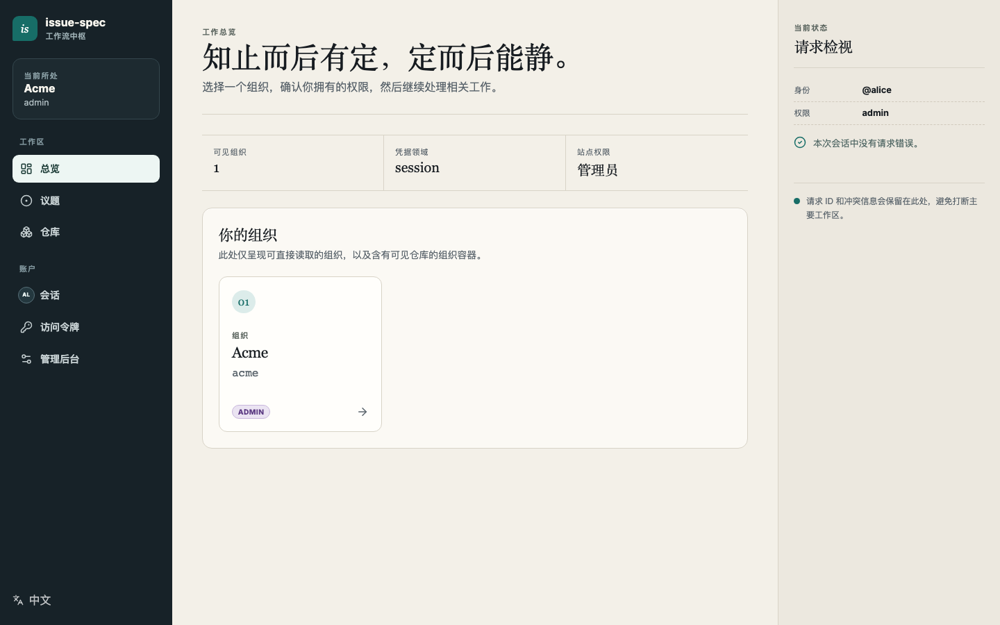
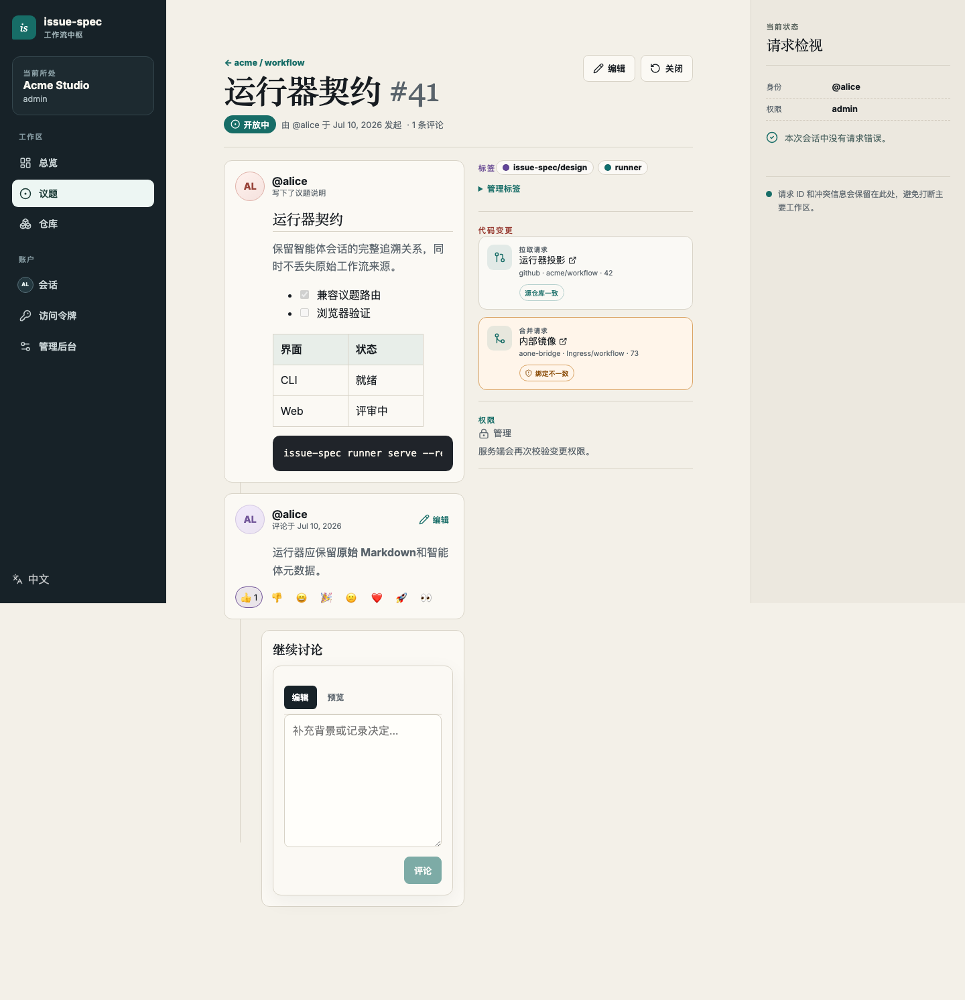
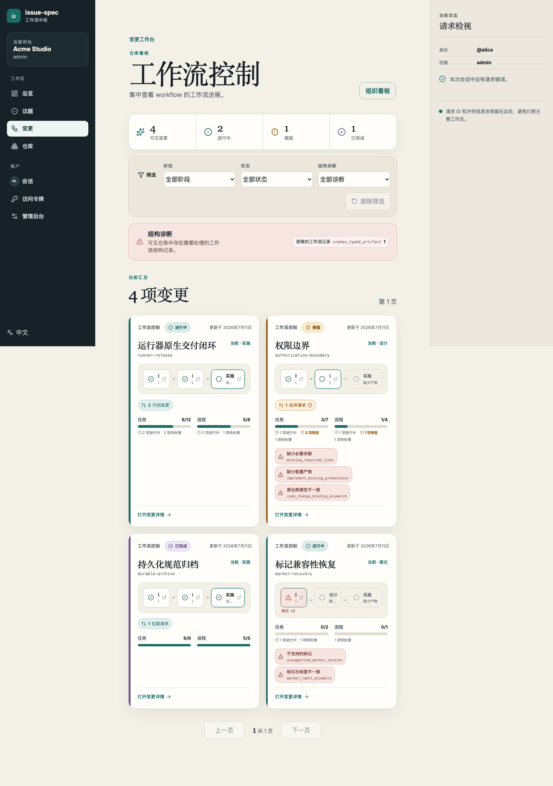
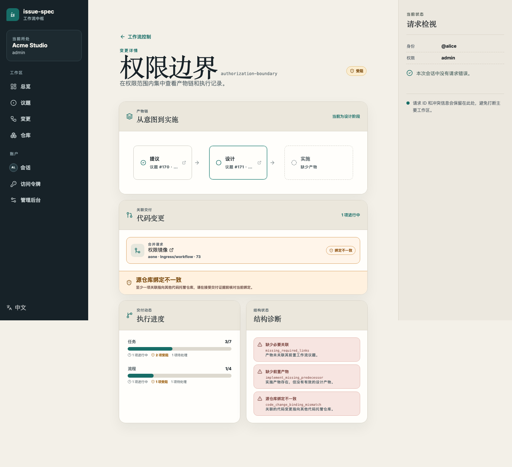
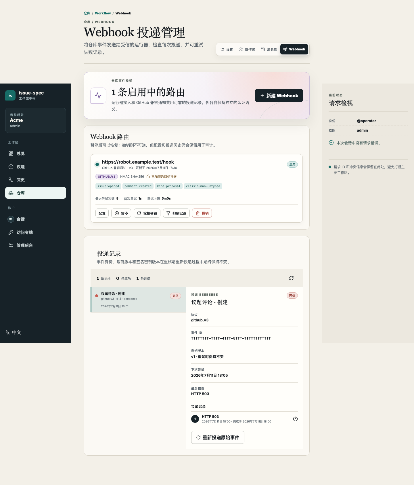

# issue-spec 自托管 Server

**[English](README.md) | 简体中文**

自托管 Server 把 issue-native 的 issue-spec 工作流部署到团队自己控制的环境中。
它在一个服务里提供 Web 工作台、GitHub 兼容 Issue API、组织与仓库权限、
provider-neutral 代码证据、Webhook、Runner，以及由 PostgreSQL 持久化的状态。

当团队需要私网部署、本地身份与权限、内部代码平台接入，或不依赖个人 GitHub
账号的自动化身份时，可以使用 self-hosted 模式。



## Server 负责什么

```text
浏览器与 issue-spec CLI
          |
          v
 issue-spec-server  <---->  GitHub OAuth 或 OIDC
    |       |
    |       +------------>  code-provider bridge / evidence writer
    |       +------------>  GitHub 兼容或 Runner Webhook
    v
 PostgreSQL
```

Server 是以下数据的权威来源：

- 组织、仓库、成员关系、Collaborator 与可见性；
- Issue、评论、Label、Reaction、类型化工作流投影和 Change Board；
- 个人与托管 PAT、Service Account、Runner 委托、Source Binding 和
  Evidence Writer 指定；
- Webhook 订阅、过滤策略、加密凭据、投递尝试、重试、重放与审计记录。

外部代码平台仍然负责源码、分支、Commit、PR/MR、Review 和 CI。Source Binding
和 Code Provider Adapter 只把证据投影到 issue-spec，不会让 Server 获得环境中的
源码凭据。

## 产品导览

### Issue 保留完整决策历史

Proposal、Design 和 Implement Issue 的正文保存当前产物；SPEC、QUESTION、TASK、
PROCESS、REVIEW 和 VERIFY 以类型化评论出现在同一时间线。普通人的评论仍可用于
讨论与通知。



### Change Board 展示工作流状态，而不只是 Issue 数量

Change Board 把 Proposal、Design 和 Implement Issue 聚合成一个 Change，并展示
生命周期、TASK/PROCESS 进度、诊断信息和关联代码变更。



详情页把追溯关系和 provider-neutral 代码关联放在一起。GitHub PR 与内部 MR 可以
属于同一个 Change，同时保留各自的 Provider 身份。



### 集成具有明确策略和完整审计

仓库管理员可以配置 Runner Intake 或 `github.v3` 通知 Webhook。通知策略可以选择
Issue 动作、Change 类型、普通/类型化评论，以及真人/自动化 Actor。URL 查询参数中
的凭据会被加密，创建后不会再次返回浏览器。



## 权限模型

仓库可见性控制读取范围，Contribution Policy 单独控制谁可以创建 Issue 或评论。

| 可见性 | 匿名用户 | 已登录的外部用户 | 成员或 Collaborator |
| --- | --- | --- | --- |
| `public` | 可读 | 可读 | 可读 |
| `internal` | 隐藏 | 可读 | 可读 |
| `private` | 隐藏 | 隐藏 | 可读 |

| Contribution Policy | 可以贡献的身份 |
| --- | --- |
| `disabled` | 无人 |
| `members` | 组织成员、Service Account 或显式 Collaborator |
| `authenticated` | 任意有效的已登录身份 |
| `public` | 仓库为 Public 时，任意有效的已登录身份 |

匿名写入始终被拒绝。通过 GitHub OAuth 或 OIDC 登录只会建立外部身份，不会自动
获得组织角色、仓库权限、Runner 权限或 Evidence Writer 身份。

## 部署路径

生产制品是单个 `issue-spec-server` 二进制或仓库中的 Runtime 容器。二进制已内嵌
生成后的 Web 应用。部署需要 PostgreSQL 和三个由运维方管理的密钥文件。

1. 阅读[部署与加固指南](operations/deployment.md)。
2. 选择 HTTPS；若必须使用内网 HTTP，完成
   [Trusted Internal HTTP 检查表](authentication/v1/trusted-internal-http.md)。
3. 配置 [GitHub OAuth](authentication/v1/github-oauth.md) 或
   [OIDC](authentication/v1/oidc.md)。
4. 构建可复现的 Server 制品：

   ```bash
   make release-server
   # 或
   make docker-server IMAGE=registry.example/issue-spec-server:VERSION
   ```

5. 启动 PostgreSQL 和 Server，并挂载必需的环境变量与密钥；`/readyz` 就绪后再
   接入团队流量。
6. 仅执行一次 Bootstrap Claim，使用配置的身份 Provider 登录，创建首个组织，
   并显式分配本地角色。
7. PostgreSQL 必须与 Token Pepper、Encryption Keyring 一起备份；参见
   [备份、恢复、升级与应急处理](operations/backup-restore.md)。

`deployments/dev` 仅用于本地开发，不要把其中的凭据或开发模式复制到生产环境。

## 接入本地仓库

先在 Web 应用的 **Access tokens** 页面创建 PAT，然后配置与 Server Origin 绑定的
self-hosted Profile。应从 `/api/v1/meta` 读取 Origin 和 Instance ID，不要自行猜测。

```bash
printf '%s\n' "$ISSUE_SPEC_TOKEN" | issue-spec auth login \
  --profile team \
  --kind self-hosted \
  --api-url https://issues.example.com \
  --native-api-url https://issues.example.com/api/v1 \
  --web-url https://issues.example.com \
  --instance-id issue-spec:00000000-0000-4000-8000-000000000000 \
  --with-token

issue-spec --profile team auth status --json
```

初始化 Server 中已经存在的仓库：

```bash
issue-spec --profile team init \
  --repo acme/workflow \
  --server-org acme \
  --server-repo workflow \
  --tools codex,claude \
  --delivery both
```

有仓库创建权限时，可以增加 `--create-if-missing` 自动注册仓库。源码位于独立代码
平台时，使用 `--bind-source`、`--provider` 和外部仓库坐标。Source Binding 只包含
规范化仓库身份和 URL，不保存个人 Clone Credential。

完整的 Provider-neutral 集成方案、运维 Registry 示例、Bridge 脚手架、代码证据
映射和 Jira 类工作项投影模式见
[对接企业代码平台与工作项平台](enterprise-provider-integration.zh-CN.md)。

## 自动化身份

Service Account 是组织范围内的非人类身份，适用于 CI、Runner、Evidence 同步和
定时集成。创建 Service Account 不会自动创建 Token，也不会自动授予仓库权限。

安全配置顺序是：

1. 创建 Service Account；
2. 只授予必需的仓库 Collaborator Role；
3. 创建绑定明确仓库、仅包含最小 Scope 的 Managed PAT；
4. 把一次性显示的 Token 放入自动化系统的 Secret Store；
5. 下线时禁用 Service Account，使其凭据失效。

Service Account 与 PAT 的操作会被标记为 Automation，Webhook 策略和审计可以把
它们与浏览器中的真人操作区分开。

## Webhook 与 Runner

两种投递协议共享同一个事务 Outbox 和 Delivery Ledger：

- `issue-spec.v1` 使用 Bearer 认证，对接 `issue-spec runner serve`；
- `github.v3` 发送 GitHub 兼容的 Issue/Comment 事件，可直接对接兼容 GitHub
  Webhook 的钉钉机器人等通知接收端。

无需解析不可信评论文本，就可以排除类型化评论或 Automation Actor。失败投递会
自动重试，超过次数后进入 Dead Letter，并能在保持事件身份不变的情况下重放。
多副本投递与恢复语义见 [HA Webhook 运维](operations/ha-webhooks.md)。
从 PAT、Source Binding、Webhook 到 systemd 启动和评论命令的完整步骤见
[自托管 Runner：通过 Issue 评论触发 Agent](runner.zh-CN.md)。

## 运维文档索引

- [认证指南](authentication/README.md)
- [部署与加固](operations/deployment.md)
- [备份、恢复、升级与应急处理](operations/backup-restore.md)
- [HA Webhook 投递](operations/ha-webhooks.md)
- [通过 Issue 评论触发 Agent：Runner 接入指南](runner.zh-CN.md)
- [企业代码平台与工作项平台集成](enterprise-provider-integration.zh-CN.md)
- [Code Provider Bridge 协议](bridges/code-provider-v1.md)
- [Git Credential Bridge 协议](bridges/git-credential-v1.md)

## 重新生成文档截图

本文图片不来自真实组织，而是由视觉回归测试使用的固定、无凭据 Playwright
Fixture 生成。

```bash
make docs-self-hosted-screenshots
```

命令会构建 Web 应用、更新中英文 Desktop Golden Snapshot，并把两种语言的文档图片
同步到 `docs/self-hosting/assets`。提交更新图片前必须检查视觉 Diff。不要用包含内部 Issue、
真实账号、Access Token 或内网环境信息的截图替换这些 Fixture。
