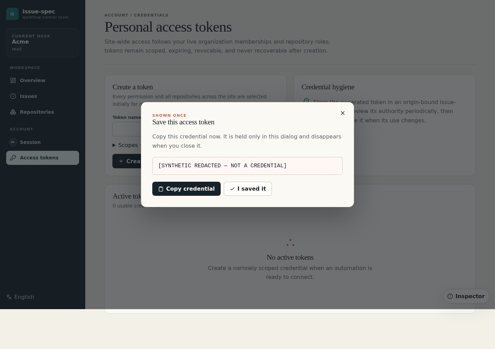
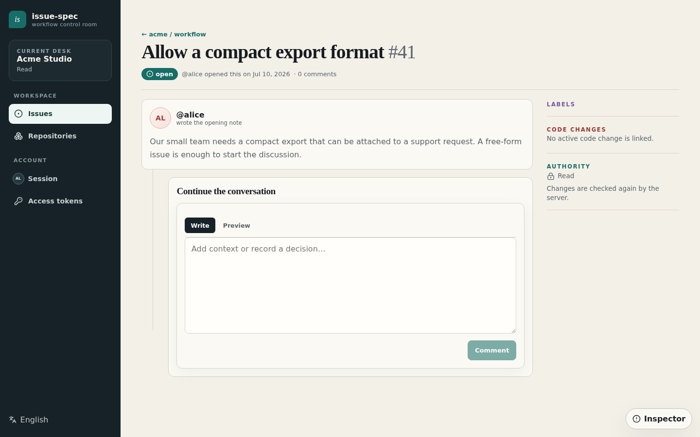
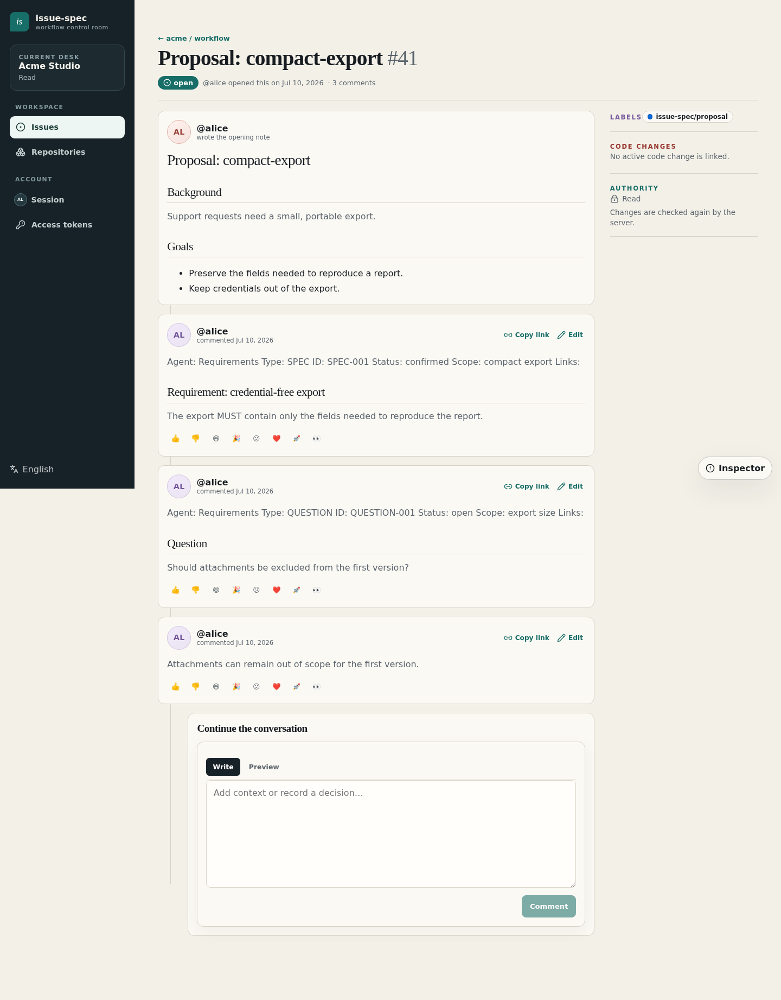

# Start a requirements workflow

**English | [简体中文](requirements-onboarding.zh-CN.md)**

This guide takes a new external user from a verified CLI installation to a
requirements issue. It uses only synthetic names and screenshots. The example
server is `https://issues.example.test`; no displayed value is a credential.

<!-- requirements-step:release -->
## 1. Install a verified release

`https://github.com/higress-group/issue-spec/releases/latest/download` follows
the latest GitHub Release from the most recent complete successful publication.
In the current release design, that is the single mutable Release named
`latest`, backed by the fixed `rolling` tag. Each complete publication stages
and verifies a draft, then replaces the visible Release and moves the tag to the
source revision recorded in the manifest and release description. Replacing the
Release also refreshes GitHub's displayed publication time.

Do not pipe a remote script into a shell. Use `curl` to download the installer,
manifest, checksums, and matching platform archive, then verify before executing:

```bash
mkdir issue-spec-install && cd issue-spec-install
base=https://github.com/higress-group/issue-spec/releases/latest/download
for file in install.sh manifest.json SHA256SUMS issue-spec_linux_amd64.tar.gz; do
  curl -fLO "$base/$file"
done
sh ./install.sh --asset-dir .
issue-spec version --json
```

PowerShell on Windows uses the same downloaded evidence:

```powershell
$base = "https://github.com/higress-group/issue-spec/releases/latest/download"
@("install.ps1", "manifest.json", "SHA256SUMS", "issue-spec_windows_amd64.zip") | ForEach-Object {
  curl.exe -fLO "$base/$_"
}
.\install.ps1 -AssetDir .
issue-spec version --json
```

Downloading the installer, manifest, checksums, and asset into the same
directory keeps the evidence in one Release set. The installer checks the
selected asset against that manifest and its SHA-256 checksums. Re-running the
same verified snapshot is idempotent. Compare the reported version, revision,
channel, and platform to the release description.

<!-- requirements-step:pat -->
## 2. Create the requirements PAT

Open `https://issues.example.test/settings/tokens?mode=requirements`, sign in,
and enter only a token name. The advanced section stays collapsed; its existing
defaults select all required scopes and site-wide repository access. The PAT
still follows the user's live repository authorization and grants nothing by
itself.

The secret is shown once. The screenshot displays only
`[SYNTHETIC REDACTED — NOT A CREDENTIAL]`.



<!-- requirements-step:context -->
## 3. Preview and save the connection

Run setup without `--yes` first. It prints the global server profile and
authenticated identity, but writes nothing:

```bash
issue-spec requirements setup \
  --server https://issues.example.test
```

After reviewing the preview, repeat with `--yes`. The normal prompt hides the
PAT. For automation or a platform without the supported secure prompt, use a
private file and standard input; never place the token in shell arguments:

```bash
issue-spec requirements setup \
  --server https://issues.example.test \
  --token-stdin --yes < ./private-token
rm ./private-token
issue-spec requirements status
```

Setup stores the PAT in the OS keyring and fails closed if secure storage is
unavailable. The origin-bound profile and global server context contain no
secret, repository, or agent choice. The saved connection works for every
project visible through that self-hosted server. Running the same command again
is safe and reports the current status.

<!-- requirements-step:skill -->
## 4. Give the skill to your agent

CLI setup does not guess how Codex, Claude, or another agent installs skills.
Give the agent this standalone Release asset and ask it to install the skill
with its own native mechanism:

[Download `issue-spec-requirements.zip` from the latest Release](https://github.com/higress-group/issue-spec/releases/latest/download/issue-spec-requirements.zip)

The archive is also listed in the Release `manifest.json` and `SHA256SUMS`.
It contains only the canonical skill and its compatibility manifest—never a
server, repository, agent path, or credential.

<!-- requirements-step:draft -->
## 5. Choose a simple or standard request

An authenticated outsider can contribute when a public repository uses the
`public` contribution policy. The existing `contribute` capability covers an
ordinary issue and its discussion; it does not grant administration, code,
runner, review, or evidence privileges. `members` and `disabled` keep their
existing restrictions.

Choose one path:

- **Simple:** a normal issue with a title and free-form description.
- **Standard:** a Proposal issue plus canonical SPEC and, when uncertainty
  remains, QUESTION comments.





The skill drafts locally first. Before any remote write it shows the exact
repository, issue title/body, labels, and comments, refreshes
`requirements status --repo acme/widgets --json`, and asks for explicit
confirmation. After confirmation it uses the equivalent of:

```bash
issue-spec --profile team issue create simple --repo acme/widgets --title "..." --body-file ./issue.md --json
issue-spec --profile team issue create proposal --repo acme/widgets --change compact-export --title "..." --body-file ./proposal.md --json
issue-spec --profile team comment upsert --repo acme/widgets --issue 42 --type SPEC --id SPEC-001 --body-file ./spec.md --json
```

It returns browser URLs for every created issue and comment. Without
`contribute`, the draft remains local; the skill never tries to bypass policy.

<!-- requirements-step:handoff -->
## 6. Hand off to design

Once Proposal, SPEC, and open QUESTIONs are coherent, summarize the agreed
requirements and ask the project to enter design. Requirements onboarding ends
there: it may read the resulting design discussion, but it does not design the
solution, create implementation tasks, modify code, or expand permissions.

Maintainers can run `make verify-requirements-acceptance` to validate this journey.
