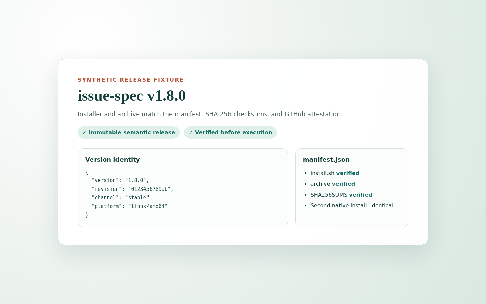

# Start a requirements workflow

**English | [简体中文](requirements-onboarding.zh-CN.md)**

This guide takes a new external user from a verified CLI installation to a
requirements issue. It uses only synthetic names and screenshots. The example
server is `https://issues.example.test`; no displayed value is a credential.

<!-- requirements-step:release -->
## 1. Install a verified release

A semantic-version release such as `v1.8.0` is immutable. `rolling` is only a
pointer updated after a complete successful build; each
`rolling-<revision>` snapshot remains immutable.

Do not pipe a remote script into a shell. Download the installer, manifest,
checksums, and attestation together, then verify before executing:

```bash
mkdir issue-spec-install && cd issue-spec-install
gh release download v1.8.0 --repo higress-group/issue-spec --dir .
for file in install.sh manifest.json SHA256SUMS issue-spec_linux_amd64.tar.gz; do
  gh attestation verify "$file" --repo higress-group/issue-spec
done
sh ./install.sh --asset-dir .
issue-spec version --json
```

PowerShell on Windows uses the same downloaded evidence:

```powershell
gh release download v1.8.0 --repo higress-group/issue-spec --dir .
@("install.ps1", "manifest.json", "SHA256SUMS", "issue-spec_windows_amd64.zip") |
  ForEach-Object { gh attestation verify $_ --repo higress-group/issue-spec }
.\install.ps1 -AssetDir .
issue-spec version --json
```

The installer checks the selected asset against the manifest and SHA-256
checksums. Re-running the same verified release is idempotent. Compare the
reported version, revision, channel, and platform to the release description.



<!-- requirements-step:pat -->
## 2. Create the requirements PAT

Open `https://issues.example.test/settings/tokens?mode=requirements`, sign in,
and enter only a token name. The advanced section stays collapsed; its existing
defaults select all required scopes and site-wide repository access. The PAT
still follows the user's live repository authorization and grants nothing by
itself.

The secret is shown once. The screenshot displays only
`[SYNTHETIC REDACTED — NOT A CREDENTIAL]`.


<!-- requirements-step:context -->
## 3. Preview and save the connection

Run setup without `--yes` first. It prints the server profile, non-secret
repository context, and skill destination, but writes nothing:

```bash
issue-spec requirements setup \
  --server https://issues.example.test \
  --repo acme/widgets --agent codex
```

After reviewing the preview, repeat with `--yes`. The normal prompt hides the
PAT. For automation or a platform without the supported secure prompt, use a
private file and standard input; never place the token in shell arguments:

```bash
issue-spec requirements setup \
  --server https://issues.example.test \
  --repo acme/widgets --agent codex --token-stdin --yes < ./private-token
rm ./private-token
issue-spec requirements status
```

Setup stores the PAT in the OS keyring and fails closed if secure storage is
unavailable. Profile and repository context files contain no secret. Running
the same command again is safe and reports the current status.

<!-- requirements-step:skill -->
## 4. Preview the skill destination

Setup explicitly previews and installs the versioned requirements skill into
the selected global Codex or Claude destination. It does not replace a
repository-local skill. If a user-modified global skill already exists, setup
stops so the user can replace it explicitly, choose another destination, or
cancel.

The standalone skill archive is an advanced alternative. Verify its
attestation, manifest, and checksum, extract into a temporary directory, print
the absolute destination, and compare the bundled compatibility manifest with
`issue-spec version --json` before copying. Prefer CLI-managed setup because it
applies the same conflict checks.

<!-- requirements-step:draft -->
## 5. Choose a simple or standard request

An authenticated outsider can contribute when a public repository uses the
`public` contribution policy. The existing `contribute` capability covers an
ordinary issue and its discussion; it does not grant administration, code,
runner, review, or evidence privileges. `members` and `disabled` keep their
existing restrictions.

Choose one path:

- **Simple:** a normal issue with a title and free-form description.
- **Standard:** a Proposal issue plus canonical SPEC and, when uncertainty
  remains, QUESTION comments.


The skill drafts locally first. Before any remote write it shows the exact
repository, issue title/body, labels, and comments, refreshes
`requirements status`, and asks for explicit confirmation. After confirmation
it uses the equivalent of:

```bash
issue-spec --profile team issue create simple --repo acme/widgets --title "..." --body-file ./issue.md --json
issue-spec --profile team issue create proposal --repo acme/widgets --change compact-export --title "..." --body-file ./proposal.md --json
issue-spec --profile team comment upsert --repo acme/widgets --issue 42 --type SPEC --id SPEC-001 --body-file ./spec.md --json
```

It returns browser URLs for every created issue and comment. Without
`contribute`, the draft remains local; the skill never tries to bypass policy.

<!-- requirements-step:handoff -->
## 6. Hand off to design

Once Proposal, SPEC, and open QUESTIONs are coherent, summarize the agreed
requirements and ask the project to enter design. Requirements onboarding ends
there: it may read the resulting design discussion, but it does not design the
solution, create implementation tasks, modify code, or expand permissions.

The executable evidence for this journey is listed in the
[requirements acceptance map](requirements-acceptance.md).
