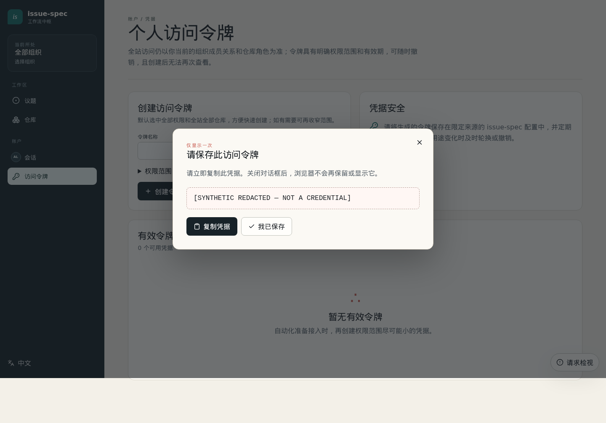
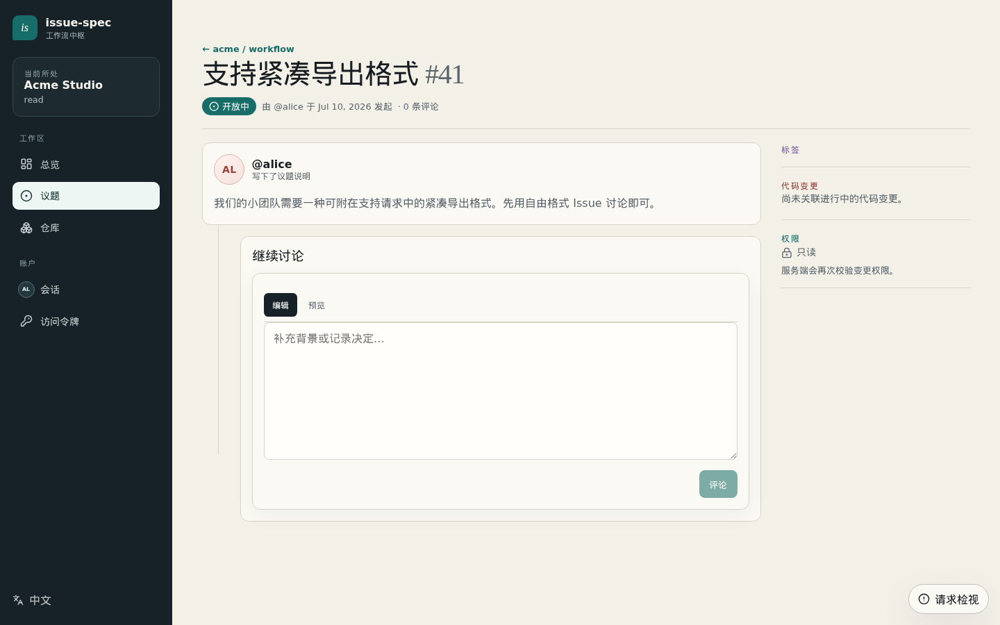
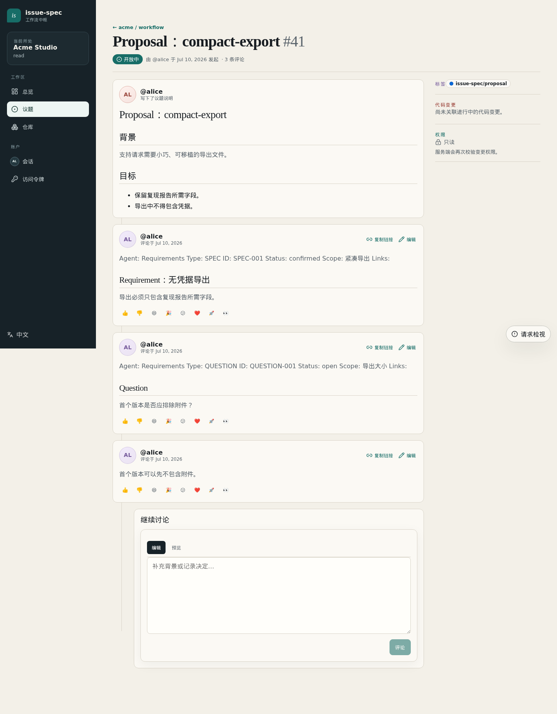

# 启动需求工作流

**[English](requirements-onboarding.md) | 简体中文**

本指南帮助新的外部用户从校验 CLI 安装开始，创建需求 Issue。所有名称与截图都是
合成数据，示例 Server 为 `https://issues.example.test`，展示值均不是凭据。

<!-- requirements-step:release -->
## 1. 安装经过校验的 Release

`https://github.com/higress-group/issue-spec/releases/latest/download` 跟随最近一次完整成功
发布所生成的 GitHub latest Release；在当前发布设计中，它是唯一且可更新的 `rolling`
Release。每次完整发布都会替换其中的制品，并把 `rolling` Tag 移动到 Manifest 和 Release
描述所记录的源码 Revision。

不要把远程脚本通过管道直接交给 Shell。只用 `curl` 把安装器、Manifest、Checksum
和对应平台制品下载到同一目录，再校验执行：

```bash
mkdir issue-spec-install && cd issue-spec-install
base=https://github.com/higress-group/issue-spec/releases/latest/download
for file in install.sh manifest.json SHA256SUMS issue-spec_linux_amd64.tar.gz; do
  curl -fLO "$base/$file"
done
sh ./install.sh --asset-dir .
issue-spec version --json
```

Windows PowerShell 使用同一组已下载证据：

```powershell
$base = "https://github.com/higress-group/issue-spec/releases/latest/download"
@("install.ps1", "manifest.json", "SHA256SUMS", "issue-spec_windows_amd64.zip") | ForEach-Object {
  curl.exe -fLO "$base/$_"
}
.\install.ps1 -AssetDir .
issue-spec version --json
```

把安装器、Manifest、Checksum 和制品下载到同一目录，可确保这些证据属于同一个
Release 集合。安装器根据该 Manifest 和 SHA-256 Checksum 校验所选制品。对同一已校验
快照重复执行是幂等的。最后把输出的版本、Revision、Channel 与 Platform 和 Release
描述进行比对。

<!-- requirements-step:pat -->
## 2. 创建需求 PAT

打开 `https://issues.example.test/settings/tokens?mode=requirements` 并登录，只填写 Token
名称。高级区域保持折叠；已有默认值会选择全部必需 Scope 和全站仓库范围。PAT 始终
跟随用户实时仓库权限，本身不会授予任何权限。

Secret 只显示一次。截图中只会出现
`[SYNTHETIC REDACTED — NOT A CREDENTIAL]`。



<!-- requirements-step:context -->
## 3. 预览并保存连接

第一次不加 `--yes`，只打印全局 Server Profile 和认证身份，不产生写入：

```bash
issue-spec requirements setup \
  --server https://issues.example.test
```

检查预览后再加 `--yes`。正常交互会隐藏 PAT；自动化或不支持安全输入提示的平台应从
私有文件通过标准输入传递，禁止把 Token 放到命令行参数中：

```bash
issue-spec requirements setup \
  --server https://issues.example.test \
  --token-stdin --yes < ./private-token
rm ./private-token
issue-spec requirements status
```

Setup 只把 PAT 写入操作系统 Keyring；安全存储不可用时会失败并停止。Origin-bound
Profile 和全局 Server Context 不含 Secret，也不保存 Repo 或 Agent。一次配置即可对接
该 Self-hosted Server 中当前用户可见的所有项目。重复执行同一命令是安全的。

<!-- requirements-step:skill -->
## 4. 把 Skill 交给 Agent

CLI Setup 不猜测 Codex、Claude 或其他 Agent 的 Skill 安装方式。把下面这个独立
Release 制品交给目标 Agent，让它用自己的原生机制安装：

[从 latest Release 下载 `issue-spec-requirements.zip`](https://github.com/higress-group/issue-spec/releases/latest/download/issue-spec-requirements.zip)

Release 的 `manifest.json` 和 `SHA256SUMS` 同样覆盖该制品。压缩包只包含规范 Skill
及兼容性 Manifest，不包含 Server、Repo、Agent 路径或凭据。

<!-- requirements-step:draft -->
## 5. 选择简单或标准需求

Public 仓库使用 `public` Contribution Policy 时，已登录外部用户可以贡献。已有的
`contribute` 能力允许普通 Issue 及其讨论；它不会授予管理、代码、Runner、Review
或 Evidence 权限。`members` 和 `disabled` 保持已有约束。

选择一种路径：

- **简单：** 标题与自由格式描述组成的普通 Issue。
- **标准：** Proposal Issue，加规范 SPEC 评论；仍有不确定性时再加 QUESTION 评论。





Skill 先在本地起草。每次远程写入前，它会显示准确的仓库、Issue 标题/正文、Label
和评论，刷新 `requirements status --repo acme/widgets --json`，并请求明确确认。确认后
使用等价命令：

```bash
issue-spec --profile team issue create simple --repo acme/widgets --title "..." --body-file ./issue.md --json
issue-spec --profile team issue create proposal --repo acme/widgets --change compact-export --title "..." --body-file ./proposal.md --json
issue-spec --profile team comment upsert --repo acme/widgets --issue 42 --type SPEC --id SPEC-001 --body-file ./spec.md --json
```

每个新建 Issue 和评论都会返回浏览器 URL。没有 `contribute` 时只保留本地草稿，Skill
绝不会尝试绕过 Policy。

<!-- requirements-step:handoff -->
## 6. 交接 Design

Proposal、SPEC 与未决 QUESTION 已经一致后，汇总已确认需求，请项目进入 Design。
需求接入到此结束：可以只读后续 Design 讨论，但不会代做方案设计、创建实现任务、
修改代码或扩大权限。

维护者可运行 `make verify-requirements-acceptance` 验证这段旅程。
