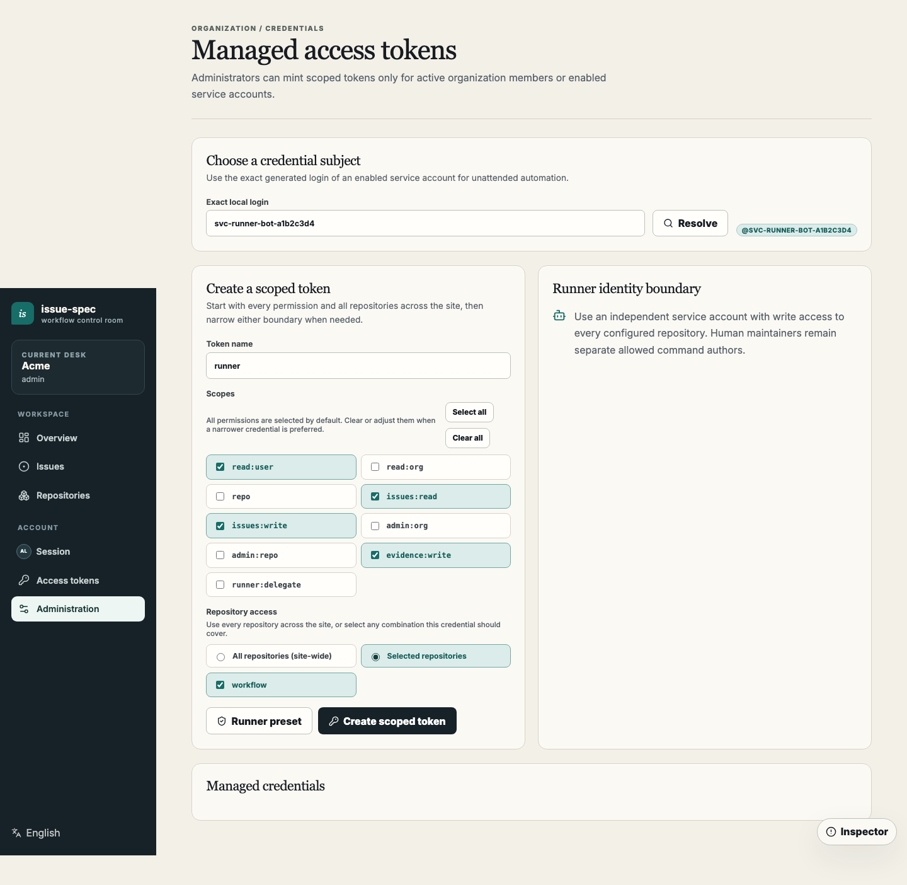
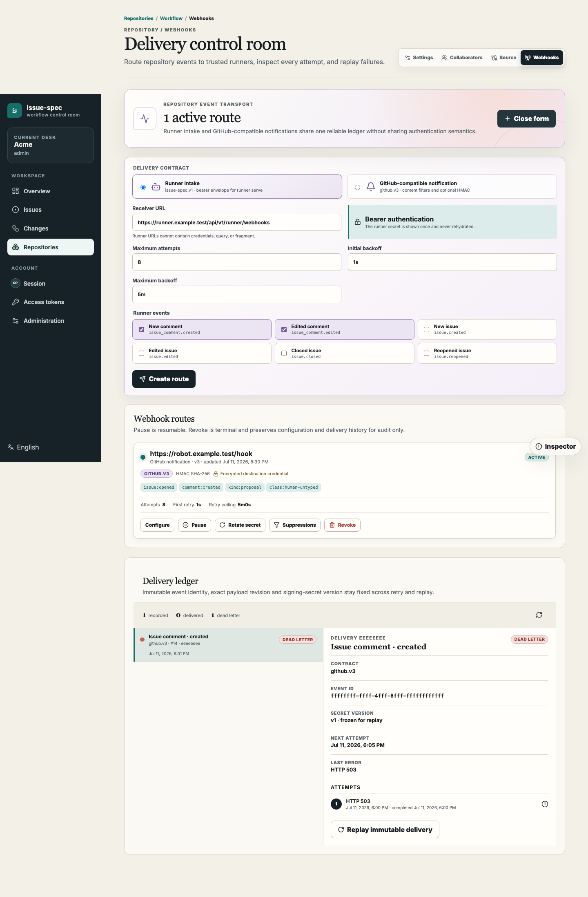
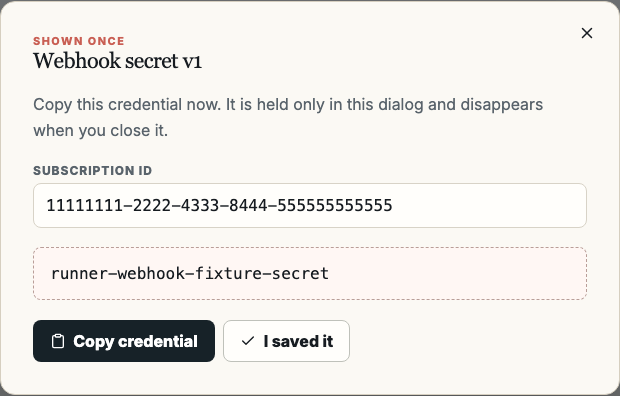
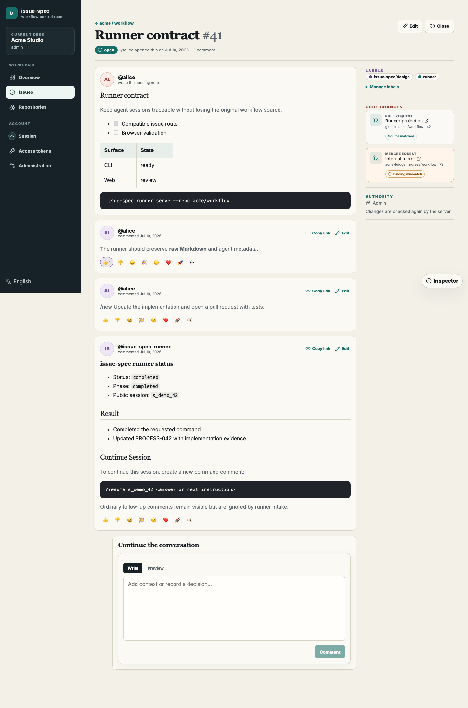

# Self-hosted runner: trigger agents from issue comments

**English | [简体中文](runner.zh-CN.md)**

[Back to the self-hosted server guide](README.md)

This guide connects a self-hosted issue-spec server to Codex or Claude through
issue comments. GitHub-backed repositories use `issue-spec runner poll`; a
self-hosted server must use `issue-spec runner serve` to receive server-pushed
webhooks.

```text
Maintainer comments /new
        |
        v
issue-spec server transactional outbox
        |
        | issue-spec.v1 + bearer secret
        v
runner serve /api/v1/runner/webhooks
        |
        +--> authorize comment author and repository
        +--> resolve source binding and job-scoped Git credential
        +--> reuse the origin-bound profile PAT
        v
      acpx --> Codex or Claude
        |
        +--> branch, commit, PR/MR, tests, and issue writeback
```

## 1. Prepare the runner host

Use a dedicated system account on Linux. Install a compatible `issue-spec`
binary, `acpx`, the selected agent runtime, `bubblewrap`, and—when using the
Codex provider—`npm` and `npx`. The host needs network access to the issue-spec
server, code host, model service, and required package registries.

The operator must also provide either an executable implementing
[`issue-spec-git-credential-v1`](bridges/git-credential-v1.md), or a dedicated
runner SSH identity for the internal compatibility mode described below. Do not
use `--unsafe-no-sandbox` unless the operator explicitly accepts that the agent
can access the runner host filesystem.

### Pin and test the Codex ACP adapter

ACPX's built-in Codex provider does not directly execute the host `codex`
binary. It starts `@agentclientprotocol/codex-acp`, which supplies a separate
Codex runtime and model catalogue. Consequently, upgrading `codex` on the host
does not update the adapter used by Runner jobs, and an npm cache can preserve
an older adapter package.

Pin a tested adapter in the Runner service user's `~/.acpx/config.json`:

```json
{
  "agents": {
    "codex": {
      "command": "npx",
      "args": ["-y", "@agentclientprotocol/codex-acp@1.1.2"]
    }
  }
}
```

`1.1.2` is an example independently validated in
[openclaw/acpx#434](https://github.com/openclaw/acpx/issues/434#issuecomment-4946457075);
pin the version that your operators have validated. The runner selectively
copies this `agents.codex` command into the job's isolated home, so the same
adapter is used inside bubblewrap. If the host cannot reach npm at runtime,
pre-cache the exact package with `npm cache add @agentclientprotocol/codex-acp@1.1.2`.

Run this smoke test as the service user before `runner serve`:

```bash
acpx config show
acpx --verbose --timeout 60 --deny-all --format json \
  codex exec 'Reply with exactly OK and do not use tools.'
```

The Runner's `--model` value is an explicit ACPX request and overrides the
model from the copied Codex config. It must exactly match a model ID advertised
by that adapter, including any reasoning-effort suffix. Test the planned value
with `--model` before deployment; a successful host `codex --version` is not
sufficient evidence.

## 2. Create the source binding

Create and activate a binding on the repository's **Source connection** page.
It supplies the provider, external repository identity, HTTPS clone URL, and
default branch without storing a clone credential. The default Git credential
command must mint a short-lived credential for this exact binding, separate
from the issue-spec PAT. Host SSH mode retains the HTTPS binding as authority
and derives only the actual transport as `git@<host>:<external_repository>.git`.

## 3. Create an independent service account and runner PAT

A production runner should not use an administrator or maintainer's personal
identity. Create one issue-spec service account for each independent runner
security boundary:

1. create an account such as `Runner Bot` under **Administration > Service accounts**
   and save its generated exact login, such as `svc-runner-bot-a1b2c3d4`;
2. resolve that login under the repository's **Collaborators** page and grant
   the minimum `write` role;
3. resolve the service account under **Administration > Managed access tokens**;
4. select **Runner preset**, then choose **All repositories (site-wide)** or every repository
   this Runner process will serve;
5. confirm the PAT includes these minimum scopes and create it:

```text
read:user, issues:read, issues:write, evidence:write
```



Save the one-time token. `--runner` must be the exact service-account login.
Add human maintainers with repeatable `--allowed-user` flags; each author must
also have write-equivalent repository permission. This keeps the runner
automation identity, command author, and Linux process user separate.
Site-wide access follows the service account's live repository roles and does
not grant access to a repository by itself.

### Simpler option: use your own account

For a local trial, personal environment, or short-lived integration, the
runner may use your own issue-spec account:

1. confirm that your account has `write` or higher permission on the repository;
2. select **Runner preset** on **Access tokens**, then choose **All repositories (site-wide)**
   or every repository this Runner process will serve;
3. save the one-time personal PAT;
4. pass your exact login to `--runner` when starting the process.

The personal PAT requires the same four minimum scopes and may cover all
repositories site-wide or a selected set of repositories. Site-wide access
follows the account's live permissions and does not grant repository authority.
By default, only the account named by `--runner` can issue commands; add
`--allowed-user` only when other maintainers should be accepted. This option is
quicker to configure, but runner writes, credential rotation, and account
disablement remain coupled to a person. Prefer a service account for shared or
long-running production automation. Never substitute a browser session cookie
or login session for the PAT.

Evidence publication is decided by the Server when evidence is appended. The
active PAT must explicitly carry `evidence:write`, allow the exact repository,
and authenticate an active identity with live `write`-or-higher repository
permission. Repository roles and `repo`, `admin:repo`, or `issues:write` scopes
never replace `evidence:write`; `evidence:write` never replaces repository
permission. The Runner preset selects the four minimum scopes above; additional
scopes no longer prevent startup, but remove any that the automation does not
need.

Legacy Evidence Writer assignments and native assignment routes remain
deprecated, non-authoritative compatibility data for one release window and
rollback. New Runner versions do not query them. Upgrade Runner before or with
Server; an older Runner still performs its client-side assignment preflight, so
keep legacy rows until every Runner is upgraded. Rolling back to an older Server
restores its former assignment gate. See
[Legacy Evidence Writer compatibility API](bridges/code-provider-v1.md#deprecated-evidence-writer-compatibility-api).

Read the public origins and instance ID from `/api/v1/meta`, then create the
origin-bound profile as the runner system user:

```bash
curl -fsS https://issues.example.test/api/v1/meta

printf '%s\n' "$ISSUE_SPEC_TOKEN" | issue-spec auth login \
  --profile team \
  --kind self-hosted \
  --api-url https://issues.example.test \
  --native-api-url https://issues.example.test/api/v1 \
  --web-url https://issues.example.test \
  --instance-id issue-spec:00000000-0000-4000-8000-000000000000 \
  --with-token

unset ISSUE_SPEC_TOKEN
issue-spec --profile team auth status --json
```

The Managed PAT or personal PAT selected above is the credential used by every
`/new` and `/resume` job. `runner serve` materializes it once in a private,
stable file outside the repository workspaces, then exposes that same file to
each agent session. It does not mint or revoke a delegated issue token per job.
Before each job, the Runner revalidates that the file still authenticates as the
configured identity, includes the four scopes above, grants the current job's
repository, and still has the required repository role.
The job fails closed on authentication, permission, repository-cap, or network
drift; Git clone and push remain independently proven by the Git credential
provider.
The Server delegation API remains available for other integrations, but is not
part of the Runner execution path. One PAT and profile may serve multiple
explicit `--repo` values when its repository access and identity permissions
cover each of them.

## 4. Create the Runner intake webhook

On the repository's **Webhooks** page, select **New webhook**:

1. keep **Runner intake (`issue-spec.v1`)** as the delivery contract;
2. enter a server-reachable URL such as
   `https://runner.example.com/api/v1/runner/webhooks`;
3. select `issue_comment.created` and `issue_comment.edited`;
4. create the route.



Save both the **Subscription ID** and one-time **Webhook secret**. They map to
`--subscription-id` and `--secret-file` respectively.



Store the secret in a file readable only by the runner user. Never put it in a
command-line argument, repository, or systemd unit. Production mode requires a
`0600` secret file and rejects environment-based webhook secrets.

## 5. Connect the code host

### Recommended: job-scoped credentials

`--git-credential-command` names an absolute operator-owned executable. The
runner invokes it without a shell and does not expose the profile PAT, webhook
secret, or host environment. The command receives a pinned source binding and
returns a job-scoped username, password, expiry, and lease ID. It must support
idempotent `revoke_lease` and `revoke_job` actions.

See [`Runner Git credential command v1`](bridges/git-credential-v1.md) for the
complete contract. A typical path is
`/usr/local/libexec/issue-spec-git-credential`.

### Internal compatibility mode: mount host SSH

When an internal code host uses SSH and the runner host and jobs share one
trusted security boundary, `--allow-host-ssh` read-only mounts the runner OS
account's `~/.ssh` into the sandbox and forwards `SSH_AUTH_SOCK` when present:

```bash
issue-spec --profile team runner serve \
  ... \
  --allow-host-ssh
```

First verify non-interactive SSH access as the same OS account and pin the code
host key in that account's `known_hosts`. `--allow-host-ssh` is mutually
exclusive with `--git-credential-command`. Pass the same `--allow-host-ssh`
flag to `runner preflight --verify-agent-runtime`; otherwise preflight uses an
isolated temporary HOME and does not represent the live Runner environment.

### Configure a repo-local commit identity

If Agent tasks create commits, configure both flags on `runner serve`:

```bash
issue-spec --profile team runner serve \
  ... \
  --git-author-name "Issue Spec Runner" \
  --git-author-email runner@example.test
```

Retained workspaces reconcile this repo-local identity on resume. Runner keeps
a repo-local ownership marker so removing the flags restores the preceding
repo-local identity; if another actor has changed either value, Runner preserves
each newer value, restores only fields still matching its managed identity, and
then relinquishes its marker.

The values are strictly validated and written as repo-local `user.name` and
`user.email` immediately after each managed clone. The Runner continues to set
`GIT_CONFIG_GLOBAL=/dev/null` and `GIT_CONFIG_NOSYSTEM=1` in Agent jobs, so this
does not import host URL rewrites, credential helpers, signing settings, or
other global Git policy. Omit both flags for read-only jobs; providing only one
is an error. Use an identity accepted by the target code host.

### macOS local development exception

Bubblewrap is Linux-only. On a trusted developer Mac, an explicit
`--unsafe-no-sandbox --allow-host-ssh` combination reuses the current Runner
OS account's SSH home directly so a private SSH source binding can clone and
push. This is for short-lived local verification only: it disables the
filesystem boundary and exposes the account's SSH authority to the Agent.
Use a dedicated low-privilege SSH identity and never use this mode for a
shared or production Runner. Linux production deployments continue to use the
read-only SSH mount above, or a job-scoped credential command.

This mode has no per-job expiry or revocation. Every agent job receives all
repository authority available to that dedicated runner SSH identity. Use a
dedicated OS account and SSH identity, retain one `runner serve` process per
repository, and do not mount a developer's everyday SSH identity.

## 6. Run preflight and start in the foreground

For a deployment candidate, add `--verify-agent-runtime` to this preflight.
It creates a temporary empty workspace and runs one tools-denied ACP session
through the configured Runner sandbox, isolated runtime homes, adapter override,
proxy environment, and any explicit `--model`.

For a self-hosted profile, preflight keeps the existing origin-bound profile,
required-scope, configured-repository, agent, acpx, and sandbox checks. It no
longer calls the legacy `/evidence/writers/me` route or emits
`evidence-writer-backend` or `evidence-writer:<repo>` checks. Preflight does not
approximate publication authority: the Server re-evaluates explicit
`evidence:write`, exact repository access, active identity, tenant visibility,
and live `write`-or-higher permission when evidence is appended.

### Make operator-owned code-host skills available to the agent

Run `issue-spec init` in the repository and commit its generated
`.agents/skills` directory with the repository workflow. The Runner then gets
the same workflow by cloning the default branch; do not duplicate repository
workflow skills through Runner configuration.

With `--agent codex`, use `--operator-skill-dir` only for an operator-owned,
trusted local skill for the selected code host. It can describe the approved
branch, push, and PR/MR procedure without putting provider-specific commands,
hostnames, or credentials in the target repository or public documentation.
The Runner copies only this explicit local input into the session's isolated
`CODEX_HOME`; other agents reject this option.

The coordinator must keep issue and code authority separate. After the
operator skill or provider bridge creates a PR/MR, it uses self-hosted
`code-change attach` to validate and associate the existing exact revision,
then `code-change link-process` to link PROCESS comments. These commands do not
create the change or ingest evidence. The Runner must not assume that a
self-hosted issue backend provides GitHub PR endpoints; review, merge, and
closure continue through the selected code provider.

```bash
cd /srv/issue-spec-workflows/acme-workflow
issue-spec --profile team init --repo acme/workflow --tools codex --delivery skills
# Review and commit .agents/skills with this repository before enabling Runner.

issue-spec --profile team runner serve \
  ... \
  --operator-skill-dir /etc/issue-spec-runner/skills/code-host
```

Each argument may name one skill directory containing `SKILL.md`, or a
directory whose immediate children are skills. Symlinks and duplicate skill
names are rejected; the Runner refreshes these copies for every session.
Repository-owned `.acpxrc.json` is also rejected because it would otherwise
override the operator-selected ACPX adapter from the repository working directory.

```bash
issue-spec --profile team runner preflight \
  --repo acme/workflow \
  --runner svc-runner-bot-a1b2c3d4 \
  --agent codex \
  --git-author-name "Issue Spec Runner" \
  --git-author-email runner@example.test \
  --verify-agent-runtime \
  --json

issue-spec --profile team runner serve \
  --repo acme/workflow \
  --runner svc-runner-bot-a1b2c3d4 \
  --allowed-user maintainer \
  --listen 127.0.0.1:9876 \
  --subscription-id 11111111-2222-4333-8444-555555555555 \
  --secret-file /etc/issue-spec-runner/webhook-secret \
  --git-credential-command /usr/local/libexec/issue-spec-git-credential \
  --state /var/lib/issue-spec-runner/state.json \
  --workspace-root /var/lib/issue-spec-runner/workspaces \
  --git-author-name "Issue Spec Runner" \
  --git-author-email runner@example.test \
  --operator-skill-dir /etc/issue-spec-runner/skills/code-host \
  --agent codex
```

For the internal SSH mode, replace the example's
`--git-credential-command /usr/local/libexec/issue-spec-git-credential` with
`--allow-host-ssh`, and add `--allow-host-ssh` to the preflight command too. On
macOS, use the same explicit `--unsafe-no-sandbox --allow-host-ssh`
combination in both commands.

Repeat `--allowed-user` and `--repo` as needed. A self-hosted profile PAT may
cover all repositories site-wide or any selected set, but the Runner preflights
each configured repository independently. The default maximum is three
concurrent jobs.

If TLS terminates at a reverse proxy, listen on loopback and expose only
`/api/v1/runner/webhooks`. For direct TLS, bind an exact non-loopback IP—not a
wildcard—and add `--production --tls-cert FILE --tls-key FILE`. The receiver URL
must be reachable from the server's delivery worker.

## 7. Run continuously with systemd

Complete profile login as the `issue-spec-runner` user and create private state
and workspace directories. Then install a unit based on this example:

```ini
[Unit]
Description=issue-spec comment-triggered runner
After=network-online.target
Wants=network-online.target

[Service]
Type=simple
User=issue-spec-runner
Group=issue-spec-runner
Environment=HOME=/var/lib/issue-spec-runner
EnvironmentFile=-/etc/issue-spec-runner/proxy.env
ExecStart=/usr/local/bin/issue-spec --profile team runner serve \
  --repo acme/workflow \
  --runner svc-runner-bot-a1b2c3d4 \
  --allowed-user maintainer \
  --listen 127.0.0.1:9876 \
  --subscription-id 11111111-2222-4333-8444-555555555555 \
  --secret-file /etc/issue-spec-runner/webhook-secret \
  --git-credential-command /usr/local/libexec/issue-spec-git-credential \
  --state /var/lib/issue-spec-runner/state.json \
  --workspace-root /var/lib/issue-spec-runner/workspaces \
  --git-author-name "Issue Spec Runner" \
  --git-author-email runner@example.test \
  --operator-skill-dir /etc/issue-spec-runner/skills/code-host \
  --agent codex
Restart=on-failure
RestartSec=5s
NoNewPrivileges=true
PrivateTmp=true
UMask=0077

[Install]
WantedBy=multi-user.target
```

```bash
sudo systemctl daemon-reload
sudo systemctl enable --now issue-spec-runner
sudo systemctl status issue-spec-runner
sudo journalctl -u issue-spec-runner -f
```

If the runner needs an outbound HTTP proxy for the model service or package
registry, keep it in the root-owned `0600` environment file referenced above:

```ini
HTTP_PROXY=http://proxy.example.test:8080
HTTPS_PROXY=http://proxy.example.test:8080
NO_PROXY=127.0.0.1,localhost,issues.example.test,code.example.test
```

The sandbox inherits the standard upper- and lower-case proxy variables from
the runner process. Keep directly reachable receiver, issue-server, and
code-host endpoints in `NO_PROXY`; do not put proxy credentials in the unit or
a public diagnostic comment. Restart the service after changing the file and
rerun `runner preflight --verify-agent-runtime` as the same user.

## 8. Trigger the agent from a comment

The command must start at the beginning of the comment:

```text
/new Fix the login failure, add tests, and open a PR
/resume s_demo_42 Apply the review feedback to error handling
/cancel s_demo_42
```

`/new` creates a public session and workspace, `/resume` continues one, and
`/cancel` cancels an eligible in-flight job. Ordinary comments do not trigger
the agent. Runner status comments contain the phase, public session ID, result,
and a copyable `/resume` template.



## 9. Verify and troubleshoot

`runner serve` prints its effective private diagnostics directory as `logs=...`
at startup. Unless `--log-dir` is set, it is the sibling `logs/` directory next
to the effective `state.json`. The directory is `0700`; Runner, error, index,
per-job, bounded ACPX stdout/stderr, and per-session files are `0600`. Use the
printed path instead of guessing a service-account layout. A minimal first
check is:

```bash
rg -n '"level":"error"|"event":"(job_failed|job_interrupted|webhook_rejected)"' <printed-log-dir>/{runner,errors}.ndjson
```

Use `index.ndjson` to resolve a delivery, job, public session, comment, ACPX
record, or workspace identifier before reading only the matching job/session
file. `--log-max-size`, `--log-max-files`, `--log-retention`, and
`--log-raw-capture` control rotation, retention, and the per-job raw capture
bound. Keep these local diagnostics out of public issue comments; copy only
sanitized identifiers and bounded error categories.

Use this acceptance ladder on a non-production repository before enabling a
team workflow:

1. run `runner preflight --verify-agent-runtime` as the service user and retain
   the bounded result, including the selected `agent_runtime` metadata;
2. post a read-only `/new` comment and verify signed webhook delivery,
   authorization, workspace creation, and the Runner status comment;
3. verify a clone and a no-op Git read using the configured job credential (or
   the expected SSH remote in host SSH mode), then verify credential revocation
   where applicable;
4. post a small documentation-only task that makes one commit and pushes its
   isolated branch; when an explicit Git author is configured, verify the
   first commit succeeds with global and system Git config disabled;
5. when a code-provider bridge advertises `change.create`, verify that the
   agent creates the PR/MR through that provider and writes the resulting change
   URL back to the issue. Without that capability, treat push evidence as the
   endpoint and create the change outside the sandbox; do not mount arbitrary
   host CLIs into bubblewrap;
6. run the current provider validator and read-only preflight, then exercise a
   non-production `merge_snapshot` at the exact head; confirm the provider
   returns policy-complete native review/check authority and a token, and that
   Runner dispatch neither synchronizes legacy evidence nor executes a
   pre-gate;
7. verify `/resume` by a different authorized maintainer, then revoke the test
   credential and remove the test workspace.

| Symptom | Check first |
| --- | --- |
| Webhook returns `401` | Subscription ID, current secret, and server/runner clocks |
| Webhook cannot connect | Receiver URL, DNS, firewall, reverse proxy, and TLS |
| Comment is ignored | Command position, allowlist, and write-equivalent permission |
| Profile PAT authentication fails | Confirm the origin-bound profile still resolves the intended Runner identity and includes `read:user`, `issues:read`, `issues:write`, and `evidence:write` |
| Legacy audit evidence publication returns `403` | This path is audit-only and cannot satisfy merge authority. If retained during a pinned rollback window, the active PAT explicitly includes `evidence:write`, allows the exact repository, and its authenticated identity still has live `write`-or-higher permission |
| Clone fails | Active source binding; for credentials, the HTTPS URL and exact binding echo; for host SSH, the runner user's key, agent, `known_hosts`, and repository access |
| Commit reports an unknown author | Configure both `--git-author-name` and `--git-author-email` with values accepted by the code host; do not restore the host global Git config |
| Sandbox preflight fails | Install `bubblewrap` or configure `--bwrap` on Linux |
| Codex does not start | Run `runner preflight --verify-agent-runtime` with the same `--allow-host-ssh`, `--unsafe-no-sandbox`, adapter pin, model, and proxy environment as the live Runner; the bounded result distinguishes timeout, adapter initialization, and model rejection |

When rotating a webhook secret, provide the old value with
`--previous-secret-file` and set a `--previous-secrets-valid-until` overlap no
longer than 24 hours. Remove the old secret after confirming delivery with the
new value.

## Security boundaries

- the webhook secret authenticates delivery only; it grants no issue or source authority;
- the origin-bound profile PAT is reused by every job and revalidated before dispatch for the current explicitly configured repository and minimum Runner scopes;
- source bindings contain no credentials; prefer short-lived, binding-specific Git credentials;
- `--allow-host-ssh` exposes the dedicated runner user's SSH authority to the sandboxed agent and is only for an explicitly trusted internal boundary;
- the runner handles only explicit `--repo` values, and authors must pass both allowlist and repository authorization;
- runner state, workspaces, and credential leases should feed centralized logs and audit.
