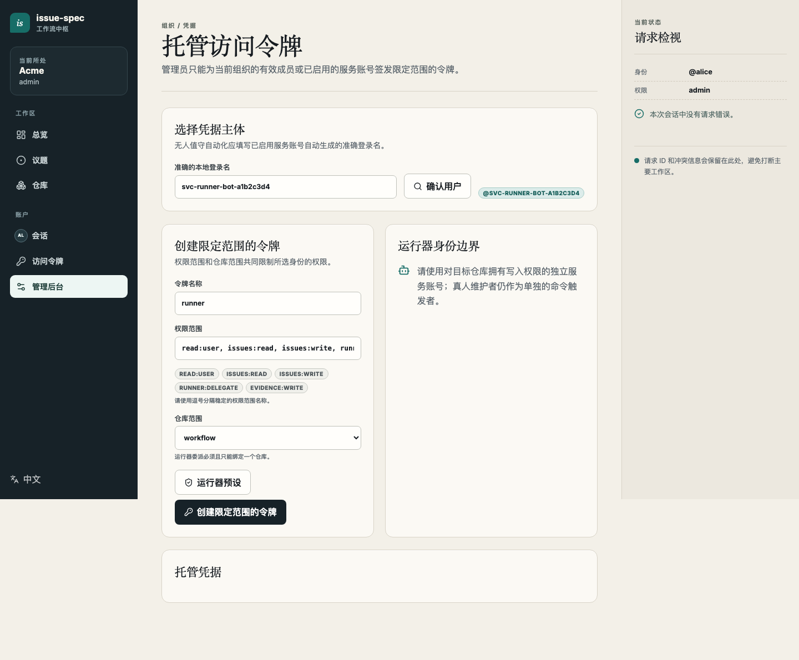
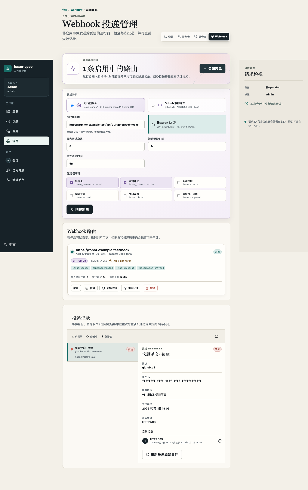
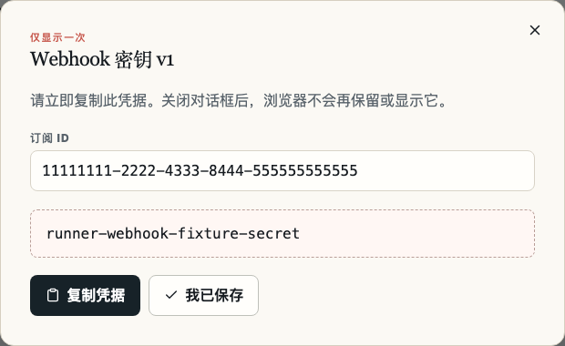
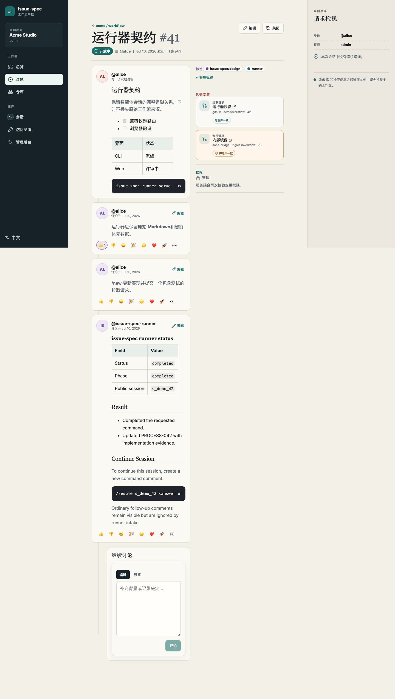

# 自托管 Runner：通过 Issue 评论触发 Agent

**[English](runner.md) | 简体中文**

[返回自托管 Server 文档](README.zh-CN.md)

本文说明如何让自托管 issue-spec Server 通过 Issue 评论触发 Codex 或 Claude
Agent。GitHub 后端使用 `issue-spec runner poll`；自托管 Server 必须使用
`issue-spec runner serve` 接收 Server 主动投递的 Webhook。

```text
维护者评论 /new
        |
        v
issue-spec Server 事务 Outbox
        |
        | issue-spec.v1 + Bearer secret
        v
runner serve /api/v1/runner/webhooks
        |
        +--> 校验评论作者与仓库权限
        +--> 获取 Source Binding 和任务级 Git 凭据，或使用宿主 SSH
        +--> 委托短期 Issue Token
        v
      acpx --> Codex 或 Claude
        |
        +--> 分支、Commit、PR/MR、测试
        +--> Issue 类型化评论和 Runner 状态评论
```

## 1. 准备 Runner 主机

推荐在 Linux 主机上以专用系统用户运行 Runner。主机需要：

- 与 Server 兼容版本的 `issue-spec`；
- `acpx`，以及所选 Agent 的运行环境；Codex Provider 还需要 `npm` 和 `npx`；
- `bubblewrap`，用于默认的文件系统沙箱；
- 到 issue-spec Server、代码平台、模型服务和所需软件源的网络；
- 一个实现 [`issue-spec-git-credential-v1`](bridges/git-credential-v1.md) 的运维侧
  Git Credential Command；可信内网也可改用 Runner 用户的宿主 SSH。

先验证本机依赖：

```bash
issue-spec --version
acpx --version
bwrap --version
```

不要把 `--unsafe-no-sandbox` 作为常规配置。只有明确接受 Agent 能访问 Runner
宿主文件系统的风险时，才使用该选项。

### 固定并验证 Codex ACP adapter

ACPX 内置的 Codex provider 不会直接执行主机上的 `codex` 二进制，而是启动
`@agentclientprotocol/codex-acp`；后者提供独立的 Codex runtime 与模型目录。因此，更新
主机 `codex` 并不会更新 Runner 任务使用的 adapter，npm cache 也可能保留旧 adapter 包。

在 Runner 服务用户的 `~/.acpx/config.json` 中固定已经验证过的 adapter：

```json
{
  "agents": {
    "codex": {
      "command": "npx",
      "args": ["-y", "@agentclientprotocol/codex-acp@1.1.2"]
    }
  }
}
```

`1.1.2` 是 [openclaw/acpx#434](https://github.com/openclaw/acpx/issues/434#issuecomment-4946457075)
独立验证过的示例；请固定运维侧已验证的版本。runner 会选择性地把该 `agents.codex`
命令复制到任务隔离的 home，因此 bubblewrap 内也会使用同一个 adapter。主机若不能在运行时
访问 npm，请预先执行 `npm cache add @agentclientprotocol/codex-acp@1.1.2` 缓存精确版本。

在启动 `runner serve` 前，以服务用户执行 smoke test：

```bash
acpx config show
acpx --verbose --timeout 60 --deny-all --format json \
  codex exec 'Reply with exactly OK and do not use tools.'
```

Runner 的 `--model` 是对 ACPX 的显式请求，会覆盖复制进来的 Codex 配置中的模型。它必须
精确匹配该 adapter 广告的模型 ID，包括可能的 reasoning-effort 后缀。部署前应用计划使用的
`--model` 再执行一次测试；仅 `codex --version` 成功不足以证明可用。

## 2. 为仓库配置 Source Binding

Runner 从 Source Binding 获取代码平台、外部仓库身份、HTTPS Clone URL 和默认分支。
在仓库的 **Source connection / 源码连接** 页面创建并启用绑定。绑定只保存仓库身份
和 URL，不保存 Clone Credential。

默认模式下，Git Credential Command 必须根据绑定签发只对该仓库有效的短期凭据。
宿主 SSH 模式仍以该 HTTPS Binding 为权威身份，只把实际 Git 传输地址派生为
`git@<host>:<external_repository>.git`。两种模式都不会把代码凭据保存到 Binding。

## 3. 创建独立 Service Account 和 Runner PAT

生产 Runner 不应使用管理员或维护者的个人身份。为每个独立的 Runner 安全边界创建
一个 issue-spec Service Account：

1. 在 **管理后台 > 服务账号** 创建账号，例如 `Runner Bot`，保存自动生成的准确
   Login，例如 `svc-runner-bot-a1b2c3d4`；
2. 在目标仓库的 **协作者** 页面解析该 Login，并授予最低的 `write` 角色；
3. 在 **管理后台 > 托管访问令牌** 中解析该 Service Account；
4. 选择 **运行器预设**，并且只选择 Runner 要服务的那个仓库；
5. 确认 Scope 包含 `read:user`、`issues:read`、`issues:write`、
   `runner:delegate` 和 `evidence:write`；
6. 创建并保存只显示一次的 Managed PAT。
7. 由仓库 Owner 或运维身份把该 Service Account 显式指定为目标仓库的有效
   **Evidence Writer**。



`--runner` 必须填写 Service Account 的准确 Login。其他真人维护者若要触发任务，使用
可重复的 `--allowed-user` 加入允许列表；Server 还会独立校验评论作者具有仓库 Write
等效权限。这样 Runner 自动化身份、评论发起人和 Linux 进程用户互不混用。

### 简化方式：使用自己的账号

本地试用、个人环境或短期联调也可以直接使用自己的 issue-spec 账号：

1. 确认自己的账号对目标仓库具有 `write` 或更高权限；
2. 在 **访问令牌** 页面选择 **运行器预设**，并且只选择目标仓库；
3. 保存只显示一次的个人 PAT；
4. 由仓库 Owner 或运维身份把自己的账号显式指定为目标仓库的有效
   **Evidence Writer**；
5. 启动时把自己的准确 Login 传给 `--runner`。

个人 PAT 使用相同的五个 Scope，并且同样必须精确绑定一个仓库。默认只有
`--runner` 对应的自己可以发出命令；需要允许其他维护者时再增加 `--allowed-user`。
这种方式配置更少，但 Runner 写入、凭据轮换和账号停用都与个人身份绑定，不适合作为
团队长期运行或多人共用的生产自动化。不要用浏览器 Session Cookie 或登录会话替代 PAT。

Evidence Writer 是 Server 按用户身份保存的持久化授权，不是 PAT Scope，也不是创建
Token 时的选项；`evidence:write` 不会让 Token 持有人自动成为 Evidence Writer。
Runner PAT 仍只保留上述五个 Scope；应使用独立的仓库管理 Session 或短期
`admin:repo` PAT 完成指定。为同一身份轮换 PAT 不需要重新指定；停用该身份或把 Runner
迁移到其他账号时，应同时停用原指定。Native API 示例见
[指定 Evidence Writer](bridges/code-provider-v1.md#assign-an-evidence-writer)。

从 Server 的 `/api/v1/meta` 读取公开地址和 Instance ID，然后在 Runner 系统用户下
创建与 Origin 绑定的 Profile：

```bash
curl -fsS https://issues.example.com/api/v1/meta

printf '%s\n' "$ISSUE_SPEC_TOKEN" | issue-spec auth login \
  --profile team \
  --kind self-hosted \
  --api-url https://issues.example.com \
  --native-api-url https://issues.example.com/api/v1 \
  --web-url https://issues.example.com \
  --instance-id issue-spec:00000000-0000-4000-8000-000000000000 \
  --with-token

unset ISSUE_SPEC_TOKEN
issue-spec --profile team auth status --json
```

上述 Managed PAT 或个人 PAT 是 Runner 的父凭据。每个任务实际使用的是 Server
委托的短期、仓库范围 Issue Token。父凭据必须精确绑定一个仓库；需要服务多个仓库时，
应为每个仓库创建独立的 PAT、Profile 和 `runner serve` 进程。

`--delegation-audience` 与 `--delegation-subject` 默认分别为 Server 的
默认值 `issue-spec-api`、`issue-spec-runner`。如果运维修改了
`DELEGATION_AUDIENCE` 或 `DELEGATION_SUBJECT`，Runner 参数也必须保持一致。
Runner 会为每个 `/new` 或 `/resume` 作业签发一次委托 Token，Agent Turn 运行期间
暂不自动续期。因此默认和最长有效期均为 7 天，确保连续运行数日的任务仍可访问
Issue API。Token 仍严格绑定单个仓库与作业，并在作业完成、失败或取消时由 Runner
立即撤销，所以 7 天是异常情况下的兜底上限，而不是通常的实际有效时长。任务始终
较短的环境可以通过 `--delegation-ttl` 把有效期缩短，最低为 `30s`。新签发 Token
在 Runner 上被判为过期时，应校准 Server 与 Runner 的时钟。

## 4. 创建 Runner Intake Webhook

进入目标仓库的 **Webhooks** 页面并选择 **New webhook / 新建 Webhook**：

1. 投递协议保持 **Runner intake (`issue-spec.v1`)**；
2. Receiver URL 填写 Runner 对 Server 可达的完整地址，例如
   `https://runner.example.com/api/v1/runner/webhooks`；
3. 选择 `issue_comment.created` 和 `issue_comment.edited`；
4. 创建路由。



创建成功后同时保存 **订阅 ID** 和只显示一次的 **Webhook 密钥**。两者分别传给
`--subscription-id` 和 `--secret-file`，不能互换。



把密钥写入仅 Runner 用户可读的文件，不要出现在命令行参数、仓库或 systemd Unit：

```bash
sudo install -d -o issue-spec-runner -g issue-spec-runner -m 0700 \
  /etc/issue-spec-runner
printf '%s\n' "$RUNNER_WEBHOOK_SECRET" | sudo install \
  -o issue-spec-runner -g issue-spec-runner -m 0600 /dev/stdin \
  /etc/issue-spec-runner/webhook-secret
unset RUNNER_WEBHOOK_SECRET
```

生产模式只接受权限为 `0600` 的 Secret File，不接受环境变量中的 Webhook 密钥。

## 5. 接入代码平台

### 推荐：任务级短期凭据

`--git-credential-command` 指向一个绝对路径的运维侧可执行文件。Runner 不通过
Shell 启动它，也不会把 Profile PAT、Webhook Secret 或宿主环境传进去。Command
根据标准输入中的固定 Source Binding 返回任务级用户名、密码、过期时间和 Lease ID，
并支持幂等的 `revoke_lease` 与 `revoke_job`。

完整 JSON 协议、校验规则和撤销语义见
[`Runner Git credential command v1`](bridges/git-credential-v1.md)。例如：

```text
/usr/local/libexec/issue-spec-git-credential
```

该程序应向代码平台的机器人凭据服务或 Token Broker 请求短期凭据；issue-spec
本身不内置任何代码平台长期凭据。

### 内部简化方式：挂载宿主 SSH

如果内部代码平台使用 SSH，且 Runner 主机和任务都属于同一可信安全边界，可以让
沙箱只读挂载 Runner 系统用户的 `~/.ssh`，并透传可选的 `SSH_AUTH_SOCK`：

```bash
issue-spec --profile team runner serve \
  ... \
  --allow-host-ssh
```

启动前先用运行 Runner 的同一个系统用户验证 SSH 可非交互访问目标仓库，并把代码平台
Host Key 固定写入其 `~/.ssh/known_hosts`。`--allow-host-ssh` 与
`--git-credential-command` 二选一。执行 `runner preflight --verify-agent-runtime` 时也要传入
同一个 `--allow-host-ssh`；否则 preflight 会使用隔离的临时 HOME，不能代表实际 Runner 环境。

### 配置 repo-local 提交身份

如果 Agent 任务需要创建提交，在 `runner serve` 中同时配置两个参数：

```bash
issue-spec --profile team runner serve \
  ... \
  --git-author-name "Issue Spec Runner" \
  --git-author-email runner@example.test
```

保留工作区恢复时会同步这组 repo-local 身份。Runner 通过 repo-local 标记记录托管关系：
移除参数时恢复此前的 repo-local 身份；若字段已被其他参与者改写，则保留被改写的值，只
恢复仍与 Runner 托管身份一致的字段，最后移除自己的托管标记。

Runner 会严格校验这两个值，并在每个受管 clone 完成后立即写入 repo-local
`user.name` 与 `user.email`。Agent 任务仍保留 `GIT_CONFIG_GLOBAL=/dev/null` 和
`GIT_CONFIG_NOSYSTEM=1`，不会继承宿主的 URL Rewrite、Credential Helper、签名设置或其他
全局 Git 策略。只读任务可以同时省略两个参数，但只提供其中一个会报错。应使用目标代码平台
认可的提交身份。

### macOS 本地开发例外

Bubblewrap 只支持 Linux。在受信开发机的 macOS 上，可以显式组合
`--unsafe-no-sandbox --allow-host-ssh`，使 Runner 直接复用当前系统用户的 SSH
Home，以便私有 SSH Source Binding 完成 clone 和 push。该组合仅用于短期本地验证：
它关闭文件系统隔离，并把该用户的 SSH 权限暴露给 Agent。必须使用权限最小化的专用
SSH 身份，不能用于共享或生产 Runner。Linux 生产环境仍应使用前述只读 SSH 挂载，或
任务级短期凭据 Command。

这是面向可信内网的兼容模式，不具备任务级凭据的过期和撤销能力。Agent 会继承该
Runner 系统用户 SSH Key 或 Agent 能访问的全部仓库权限，因此应使用专用系统账号和
专用 SSH 身份，并继续保持“一仓库一个 `runner serve` 进程”的隔离方式。不要挂载
个人日常账号的整个 SSH 身份。

## 6. Preflight 与前台启动

部署候选版本应在本段命令中加上 `--verify-agent-runtime`。它会创建临时空工作区，并通过
Runner 实际配置的沙箱、隔离运行目录、adapter override、Proxy 环境和显式 `--model`，执行
一次禁止工具的 ACP session。

### 把运行方维护的代码平台技能提供给 Agent

在仓库中执行 `issue-spec init` 后，应把生成的 `.agents/skills` 与仓库 workflow 一起
评审并提交。Runner clone 默认分支时会自然获得同一份 workflow，不要再通过 Runner 配置
重复注入仓库 workflow。

仅在使用 `--agent codex` 时，才可通过 `--operator-skill-dir` 提供运行方维护、受信任的本地
代码平台 Skill。它可以说明已批准的分支、推送和 PR/MR 创建步骤，同时避免把 Provider 专属
命令、主机名或凭据写进目标仓库和公开文档。Runner 只会把这个显式本地输入复制到会话隔离的
`CODEX_HOME`；其他 Agent 会拒绝该参数。

```bash
cd /srv/issue-spec-workflows/acme-workflow
issue-spec --profile team init --repo acme/workflow --tools codex --delivery skills
# 评审并把 .agents/skills 与该仓库一起提交后，再启用 Runner。

issue-spec --profile team runner serve \
  ... \
  --operator-skill-dir /etc/issue-spec-runner/skills/code-host
```

每个参数既可指向包含 `SKILL.md` 的一个技能目录，也可指向其第一层子目录均为技能的目录。
符号链接和重名 Skill 会被拒绝，Runner 会为每次会话重新复制这些技能。
仓库自带的 `.acpxrc.json` 也会被拒绝，防止它从仓库工作目录覆盖运行方选定的 ACPX adapter。

先用 self-hosted Profile 检查仓库权限、Agent、acpx 和沙箱：

```bash
issue-spec --profile team runner preflight \
  --repo acme/workflow \
  --runner svc-runner-bot-a1b2c3d4 \
  --agent codex \
  --git-author-name "Issue Spec Runner" \
  --git-author-email runner@example.test \
  --verify-agent-runtime \
  --json
```

再前台启动一次，确认日志中显示预期的 Profile、Subscription、监听地址和 Endpoint：

```bash
issue-spec --profile team runner serve \
  --repo acme/workflow \
  --runner svc-runner-bot-a1b2c3d4 \
  --allowed-user maintainer \
  --listen 127.0.0.1:9876 \
  --subscription-id 11111111-2222-4333-8444-555555555555 \
  --secret-file /etc/issue-spec-runner/webhook-secret \
  --git-credential-command /usr/local/libexec/issue-spec-git-credential \
  --state /var/lib/issue-spec-runner/state.json \
  --workspace-root /var/lib/issue-spec-runner/workspaces \
  --git-author-name "Issue Spec Runner" \
  --git-author-email runner@example.test \
  --operator-skill-dir /etc/issue-spec-runner/skills/code-host \
  --agent codex
```

内部 SSH 模式只需把上例中的
`--git-credential-command /usr/local/libexec/issue-spec-git-credential` 替换为
`--allow-host-ssh`，并在 preflight 命令中也添加 `--allow-host-ssh`。macOS 上两个命令都应使用
相同的显式 `--unsafe-no-sandbox --allow-host-ssh` 组合。

`--allowed-user` 可以重复。默认最多并行运行 3 个任务，可用
`--max-concurrent-jobs` 调整。同一个父凭据不能跨仓库委托任务。

### 网络和 TLS

- Runner 前面已有 HTTPS 反向代理时，让 `runner serve` 监听 Loopback，代理只转发
  `/api/v1/runner/webhooks`。
- Runner 直接提供 HTTPS 时，使用精确的非 Loopback IP，而不是通配地址，并添加
  `--production --tls-cert FILE --tls-key FILE`。
- Server 保存的 Receiver URL 必须能从 Server 投递 Worker 访问；不要填写仅浏览器
  或 Runner 自己可达的地址。

## 7. 使用 systemd 持续运行

先确保 `issue-spec-runner` 用户已经完成 Profile 登录，并拥有状态和 Workspace 目录：

```bash
sudo install -d -o issue-spec-runner -g issue-spec-runner -m 0700 \
  /var/lib/issue-spec-runner
```

创建 `/etc/systemd/system/issue-spec-runner.service`：

```ini
[Unit]
Description=issue-spec comment-triggered runner
After=network-online.target
Wants=network-online.target

[Service]
Type=simple
User=issue-spec-runner
Group=issue-spec-runner
Environment=HOME=/var/lib/issue-spec-runner
EnvironmentFile=-/etc/issue-spec-runner/proxy.env
ExecStart=/usr/local/bin/issue-spec --profile team runner serve \
  --repo acme/workflow \
  --runner svc-runner-bot-a1b2c3d4 \
  --allowed-user maintainer \
  --listen 127.0.0.1:9876 \
  --subscription-id 11111111-2222-4333-8444-555555555555 \
  --secret-file /etc/issue-spec-runner/webhook-secret \
  --git-credential-command /usr/local/libexec/issue-spec-git-credential \
  --state /var/lib/issue-spec-runner/state.json \
  --workspace-root /var/lib/issue-spec-runner/workspaces \
  --git-author-name "Issue Spec Runner" \
  --git-author-email runner@example.test \
  --operator-skill-dir /etc/issue-spec-runner/skills/code-host \
  --agent codex
Restart=on-failure
RestartSec=5s
NoNewPrivileges=true
PrivateTmp=true
UMask=0077

[Install]
WantedBy=multi-user.target
```

启动并查看日志：

```bash
sudo systemctl daemon-reload
sudo systemctl enable --now issue-spec-runner
sudo systemctl status issue-spec-runner
sudo journalctl -u issue-spec-runner -f
```

如果 Runner 访问模型服务或软件源需要出站 HTTP Proxy，将其放入上面引用的、由 root 管理且
权限为 `0600` 的环境文件：

```ini
HTTP_PROXY=http://proxy.example.test:8080
HTTPS_PROXY=http://proxy.example.test:8080
NO_PROXY=127.0.0.1,localhost,issues.example.test,code.example.test
```

沙箱会继承 Runner 进程中的大小写标准 Proxy 环境变量。能直连的 Receiver、Issue Server 与
代码平台应放进 `NO_PROXY`；不要把 Proxy 凭据写进 systemd Unit 或公开的排障评论。修改环境
文件后重启服务，并以同一用户执行 `runner preflight --verify-agent-runtime`。

## 8. 通过评论触发 Agent

命令必须从评论第一行开头开始：

```text
/new 修复登录失败问题，补充测试并创建 PR
/resume s_demo_42 按评审建议调整错误处理
/cancel s_demo_42
```

- `/new <prompt>` 创建新的公共 Session 和 Workspace；
- `/resume <public-session-id> <prompt>` 继续原 Session；
- `/cancel <public-session-id>` 取消允许取消的在途任务；
- 普通评论不会触发 Agent。

Runner 会在 Issue 时间线写入状态、阶段、Public Session ID、结果和可复制的
`/resume` 模板。公共 Session 属于仓库中被授权的维护者，不是某个人的私有会话。



## 9. 验证与排障

在启用团队工作流前，先在非生产仓库按以下阶梯验收：

1. 以服务用户运行 `runner preflight --verify-agent-runtime`，保留有界的结果以及选中的
   `agent_runtime` metadata；
2. 发表评论 `/new` 执行只读任务，确认签名 Webhook 投递、作者授权、Workspace 创建和
   Runner 状态评论；
3. 用配置的任务凭据完成 clone 和无修改的 Git 读取；适用时确认凭据已撤销。宿主 SSH 模式
   则确认实际 Remote 正确；
4. 下达一个只修改文档的最小任务，确认它能提交并推送隔离分支；配置显式 Git Author 时，
   还要确认在禁用全局和系统 Git 配置后第一次提交即可成功；
5. 当 code-provider bridge 广告 `change.create` 时，确认 Agent 通过该 provider 创建 PR/MR，
   并把变更 URL 回写到 Issue。未提供该能力时，把推送证据作为终点，在沙箱外创建变更；不要
   为此向 bubblewrap 挂载任意宿主 CLI；
6. 对变更的准确当前 Revision 同步一次 `evidence.snapshot`，确认 Server 接受由已指定
   Runner 身份写入的证据；
7. 让另一位被授权维护者执行 `/resume`，然后撤销测试凭据并删除测试 Workspace。

| 现象 | 优先检查 |
| --- | --- |
| Webhook 为 `401` | Subscription ID、当前 Secret、Runner 与 Server 时钟 |
| Webhook 无法连接 | Receiver URL、DNS、防火墙、反向代理和 TLS |
| 评论被忽略 | 命令是否位于开头、作者是否在允许列表、是否具有 Write 权限 |
| `runner:delegate` 失败 | PAT 是否只限制到该仓库，以及是否包含 `read:user`、`issues:read`、`issues:write`、`runner:delegate`、`evidence:write` |
| Provider Snapshot 返回 `403` | PAT 所属身份是否为当前仓库的有效 Evidence Writer；同时检查 `evidence:write`、准确的单仓库限定和当前 Write 等效权限 |
| 新签发的委托 Token 被判为过期 | 校准 Server 与 Runner 时钟；不要通过延长 `--delegation-ttl` 掩盖时钟漂移 |
| 找不到源码或 Clone 失败 | Source Binding 是否 Active；短期凭据模式检查 HTTPS URL 与 Command 回显，宿主 SSH 模式检查 Runner 用户的 Key、Agent、`known_hosts` 和仓库权限 |
| 提交时报作者身份未知 | 同时配置 `--git-author-name` 与 `--git-author-email`，并使用代码平台认可的值；不要恢复宿主全局 Git 配置 |
| Preflight 报沙箱失败 | Linux 上安装 `bubblewrap` 或显式配置 `--bwrap` |
| Codex 无法启动 | 使用与实际 Runner 相同的 `--allow-host-ssh`、`--unsafe-no-sandbox`、adapter 固定版本、模型和 Proxy 环境运行 `runner preflight --verify-agent-runtime`；有界结果会区分超时、adapter 初始化失败与模型拒绝 |

轮换 Webhook Secret 时，先在 Web UI 轮换，再把旧 Secret 作为
`--previous-secret-file` 提供，并用 `--previous-secrets-valid-until` 设置最长 24 小时的
重叠窗口。确认新 Secret 投递成功后移除旧 Secret。

## 安全边界

- Webhook Secret 只验证 Server 到 Runner 的投递，不授予 Issue 或代码权限；
- Profile PAT 只用于向 Server 委托短期、仓库范围的任务 Token；
- Source Binding 始终不含凭据；优先按 Job 和 Binding 短期签发 Git 凭据；
- `--allow-host-ssh` 会把专用 Runner 用户的 SSH 权限暴露给沙箱内 Agent，只适用于明确
  接受这一边界的可信内网；
- Agent 只能处理明确配置的 `--repo`，评论作者还必须同时通过允许列表和仓库权限校验；
- Runner 状态、Workspace 和 Credential Lease 都应进入集中日志与审计。
